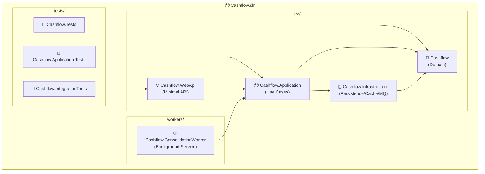
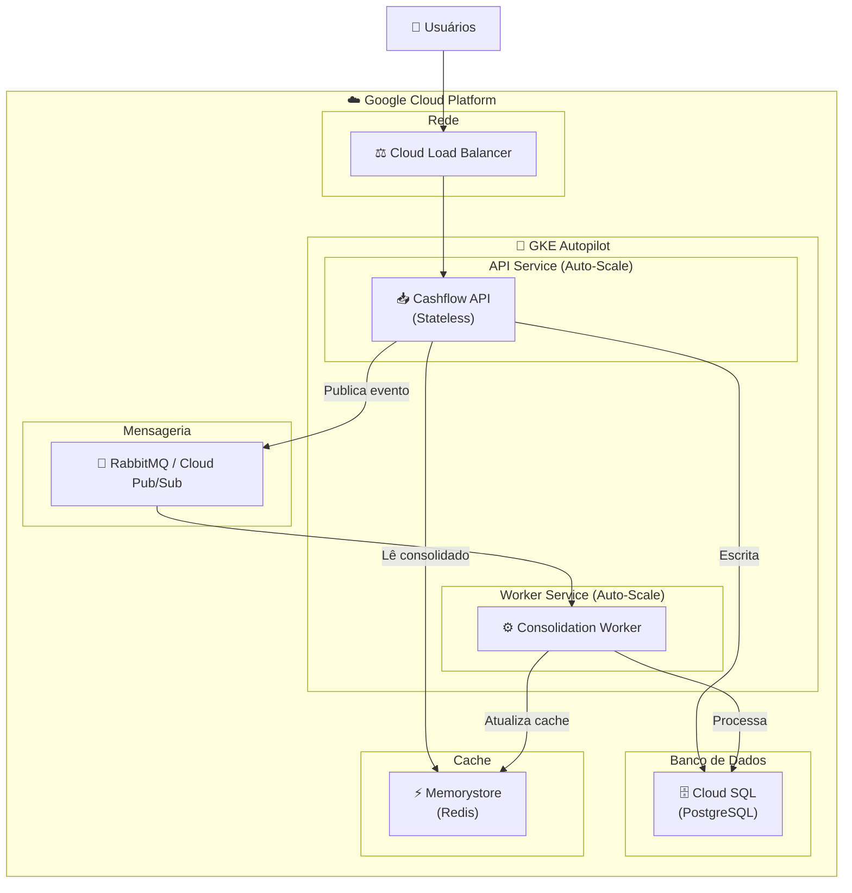
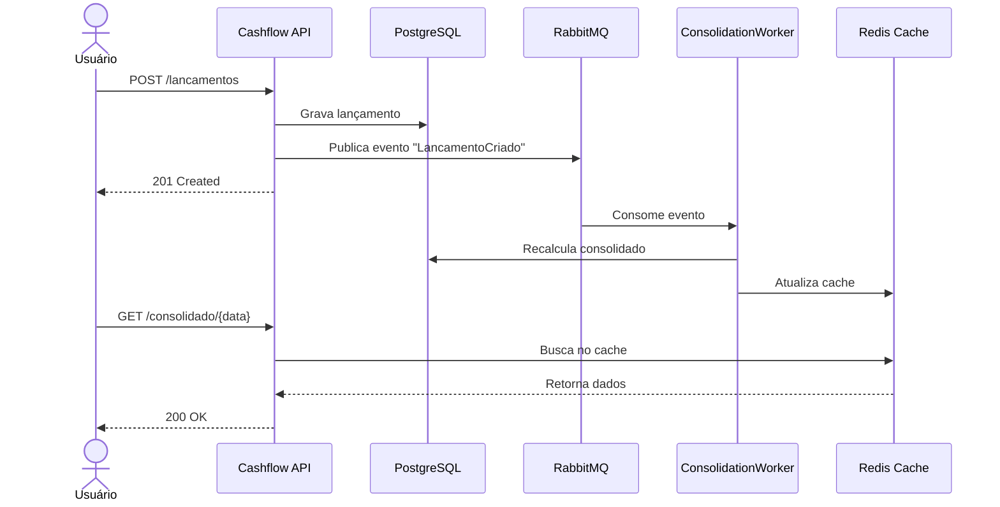
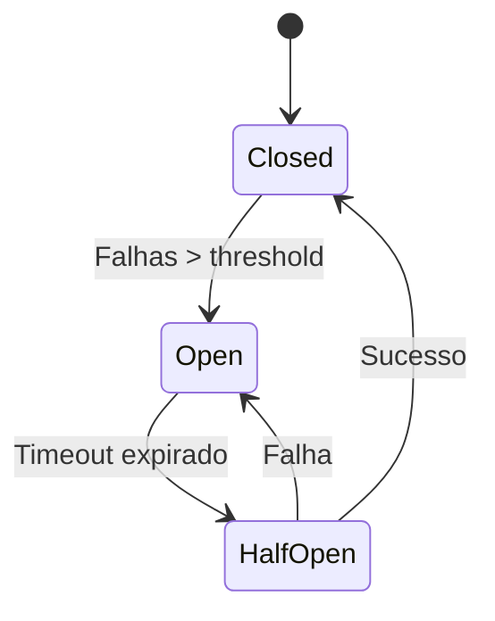
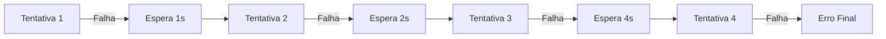
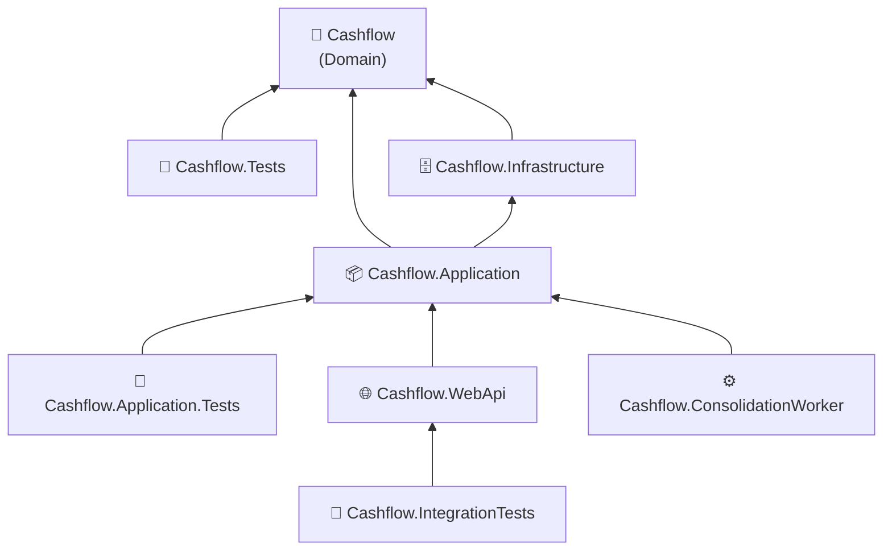
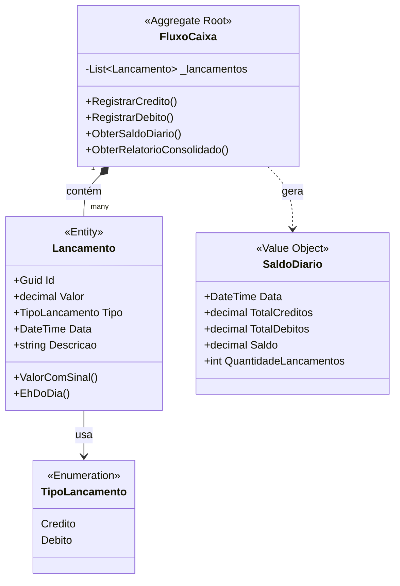

# 🏗️ Arquitetura

Este documento explica as decisões arquiteturais do projeto Cashflow e os motivos por trás de cada escolha.

## 📐 Visão Geral da Arquitetura

### Arquitetura Atual



### Arquitetura de Produção

A arquitetura de produção foi definida com base nos seguintes **requisitos não-funcionais**:

| Requisito | Descrição |
|-----------|-----------|
| **Resiliência** | Serviço de lançamentos não pode ficar indisponível se o consolidado cair |
| **Throughput** | 50 requisições/segundo no pico (consolidado) |
| **Tolerância a falhas** | Máximo 5% de perda de requisições |
| **Escalabilidade** | Escalar horizontalmente quando necessário |

---

## 🎯 Arquitetura Escolhida: Fila de Mensagens

Após análise de alternativas, a **Arquitetura com Fila de Mensagens** foi escolhida por oferecer o melhor equilíbrio entre resiliência, escalabilidade e complexidade.

### Diagrama da Arquitetura



### Por que essa arquitetura?

| Critério | Benefício |
|----------|-----------|
| **Desacoplamento** | Lançamentos e Consolidado são independentes |
| **Resiliência** | Se consolidado cair, lançamentos continua funcionando |
| **Escalabilidade** | API e Workers escalam independentemente |
| **Performance** | Consolidado servido via cache (Redis) |
| **Confiabilidade** | Fila garante que nenhum evento é perdido |

### Fluxo de Dados



---

## 🛠️ Stack Tecnológica

| Camada | Tecnologia | Motivo |
|--------|------------|--------|
| **API** | ASP.NET Minimal API | Leve, rápido, stateless |
| **Mensageria** | RabbitMQ / Cloud Pub/Sub | Escalável, durável |
| **Cache** | Redis (Memorystore) | Baixa latência, distribuído |
| **Banco** | PostgreSQL (Cloud SQL) | Confiável, suporta read replicas |
| **Container** | Docker + Kubernetes | Auto-scaling, gerenciado |
| **Resiliência** | Polly | Circuit breaker, retry, timeout |

### Bibliotecas .NET

| Biblioteca | Propósito |
|------------|-----------|
| **Polly** | Resiliência (retry, circuit breaker) |
| **FluentValidation** | Validação de requests |
| **Serilog** | Logging estruturado |
| **Testcontainers** | Testes de integração |

---

## 🔄 Padrões de Resiliência

### Circuit Breaker



### Retry com Exponential Backoff



---

## 📊 Critérios de Auto-Scale

| Serviço | Métrica | Escala quando |
|---------|---------|---------------|
| **API** | CPU / Requests | CPU > 70% ou > 100 req/s |
| **Worker** | Queue depth | Fila > 1000 mensagens |
| **Redis** | Memória | > 80% memória |

---

## 📁 Estrutura de Pastas (Atual)

```
Cashflow.sln
│
├── src/
│   ├── Cashflow/                         # 🎯 Domínio (DDD)
│   │   ├── TipoLancamento.cs             # Enum
│   │   ├── Lancamento.cs                 # Entidade
│   │   ├── SaldoDiario.cs                # Value Object
│   │   └── FluxoCaixa.cs                 # Agregado Raiz
│   │
│   ├── Cashflow.Application/             # 📦 Casos de Uso
│   │   ├── Abstractions/                 # Interfaces de serviços
│   │   ├── DTOs/                         # Data Transfer Objects
│   │   ├── Services/                     # Implementação dos serviços
│   │   └── Validators/                   # FluentValidation
│   │
│   ├── Cashflow.Infrastructure/          # 🗄️ Infraestrutura
│   │   ├── Persistence/                  # EF Core, Repositories
│   │   ├── Cache/                        # Redis
│   │   └── Messaging/                    # RabbitMQ
│   │
│   └── Cashflow.WebApi/                  # 🌐 API REST
│       ├── Endpoints/                    # Minimal API endpoints
│       └── Program.cs                    # Configuração
│
├── workers/
│   └── Cashflow.ConsolidationWorker/     # ⚙️ Worker de Consolidação
│       ├── ConsolidationWorkerService.cs # Consumer RabbitMQ
│       └── Program.cs                    # Host configuration
│
├── tests/
│   ├── Cashflow.Tests/                   # Testes de domínio (26)
│   ├── Cashflow.Application.Tests/       # Testes unitários (54)
│   └── Cashflow.IntegrationTests/        # Testes de integração (55)
│
├── docs/                                 # 📚 Documentação
│
├── Dockerfile                            # Build da API
├── Dockerfile.worker                     # Build do Worker
├── docker-compose.yml                    # Infraestrutura
└── docker-compose.override.yml           # Dev overrides
```

---

## 🔄 Fluxo de Dependências



**Importante:** O projeto de domínio (`Cashflow`) não tem dependências externas, apenas do .NET. Isso é intencional para:

- ✅ Manter o domínio puro e testável
- ✅ Evitar acoplamento com frameworks
- ✅ Facilitar evolução independente

---

## 🎯 Princípios Arquiteturais

### 1. Domain-Driven Design (DDD) Tático

Utilizamos os building blocks do DDD para modelar o domínio:



| Conceito | Implementação | Propósito |
|----------|---------------|-----------|
| **Entity** | `Lancamento` | Objeto com identidade única |
| **Value Object** | `SaldoDiario` | Objeto imutável definido por atributos |
| **Aggregate Root** | `FluxoCaixa` | Ponto de entrada para o agregado |
| **Enum** | `TipoLancamento` | Valores enumerados do domínio |

### 2. Rich Domain Model

O domínio contém **comportamento**, não apenas dados:

```csharp
// ❌ Modelo Anêmico (evitamos)
public class Lancamento
{
    public decimal Valor { get; set; }
    public TipoLancamento Tipo { get; set; }
}

// ✅ Modelo Rico (adotamos)
public class Lancamento
{
    public decimal Valor { get; private set; }
    public TipoLancamento Tipo { get; private set; }
    
    public Lancamento(decimal valor, TipoLancamento tipo, ...)
    {
        ValidarValor(valor);  // Validação no construtor
        // ...
    }
    
    public decimal ValorComSinal => ...;  // Comportamento
    public bool EhDoDia(DateTime dia) => ...; // Comportamento
}
```

**Benefícios:**
- ✅ Regras de negócio encapsuladas na entidade
- ✅ Impossível criar objeto em estado inválido
- ✅ Comportamento junto com os dados

### 3. Fail Fast

Validações são feitas no momento da criação:

```csharp
public Lancamento(decimal valor, TipoLancamento tipo, DateTime data, string descricao)
{
    ValidarValor(valor);      // Falha imediatamente se inválido
    ValidarDescricao(descricao);
    
    // Só atribui se passar nas validações
    Valor = valor;
    // ...
}
```

**Benefícios:**
- ✅ Erros são detectados o mais cedo possível
- ✅ Não existe objeto em estado inconsistente
- ✅ Stack trace aponta exatamente onde ocorreu o problema

### 4. Imutabilidade (onde faz sentido)

Propriedades com `private set` para proteger o estado:

```csharp
public decimal Valor { get; private set; }  // Só pode ser definido internamente
```

**Benefícios:**
- ✅ Evita modificações acidentais
- ✅ Thread-safety mais simples
- ✅ Facilita raciocínio sobre o código

---

## 📚 Referências

- [Domain-Driven Design - Eric Evans](https://www.domainlanguage.com/ddd/)
- [Clean Architecture - Robert C. Martin](https://blog.cleancoder.com/uncle-bob/2012/08/13/the-clean-architecture.html)
- [.NET Project Structure Best Practices](https://docs.microsoft.com/en-us/dotnet/core/porting/project-structure)
- [Cloud Pub/Sub Documentation](https://cloud.google.com/pubsub/docs)
- [GKE Autopilot](https://cloud.google.com/kubernetes-engine/docs/concepts/autopilot-overview)
