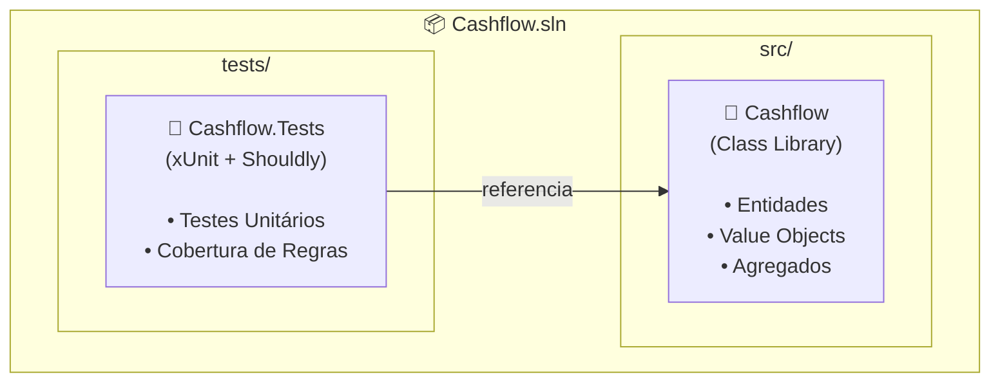
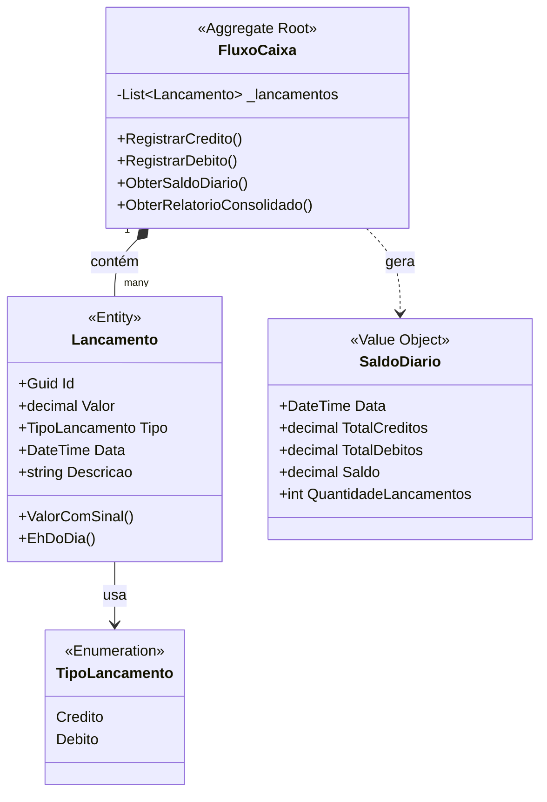
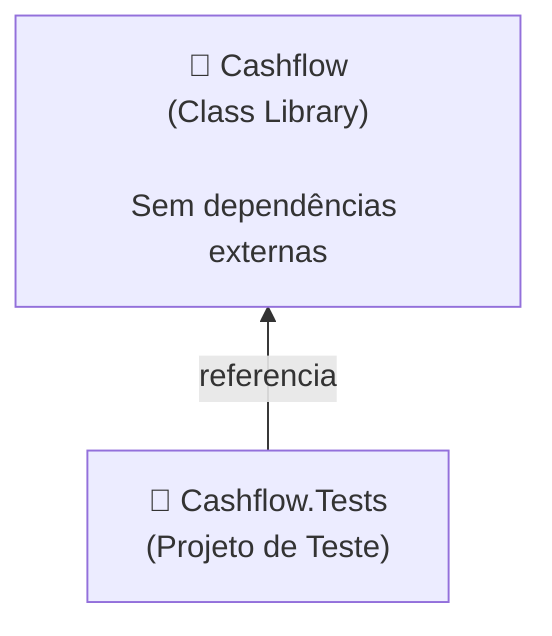
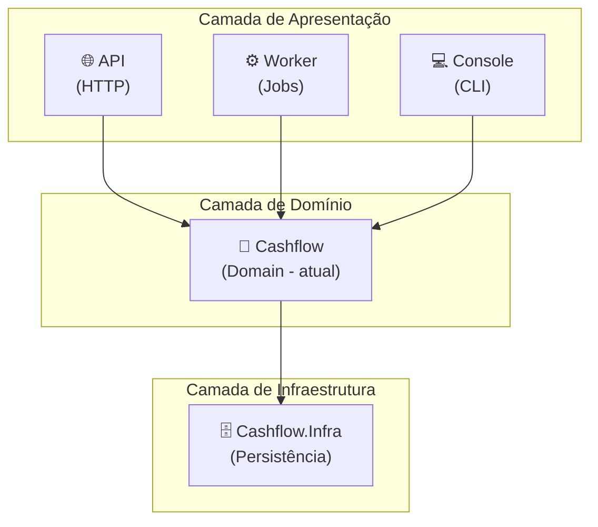

# 🏗️ Arquitetura

Este documento explica as decisões arquiteturais do projeto Cashflow e os motivos por trás de cada escolha.

## 📐 Visão Geral da Arquitetura



## 🤔 Por que essa estrutura?

### Separação `src/` e `tests/`

```
├── src/           # Código de produção
└── tests/         # Código de testes
```

**Motivos:**
- ✅ **Clareza**: Separação óbvia entre código de produção e testes
- ✅ **Build**: Permite compilar apenas o código de produção para deploy
- ✅ **Convenção**: Padrão amplamente adotado na comunidade .NET
- ✅ **CI/CD**: Facilita configuração de pipelines

### Class Library para o Domínio

Optamos por uma **Class Library** (`Cashflow`) em vez de uma aplicação executável.

**Motivos:**
- ✅ **Reutilização**: O domínio pode ser referenciado por qualquer tipo de aplicação (API, Console, Worker, etc.)
- ✅ **Isolamento**: Regras de negócio ficam isoladas de frameworks e infraestrutura
- ✅ **Testabilidade**: Facilita testes unitários sem dependências externas
- ✅ **Evolução**: Permite adicionar camadas (API, Persistência) sem modificar o domínio

## 🎯 Princípios Arquiteturais

### 1. Domain-Driven Design (DDD) Tático

Utilizamos os building blocks do DDD para modelar o domínio:



| Conceito | Implementação | Propósito |
|----------|---------------|-----------|
| **Entity** | `Lancamento` | Objeto com identidade única |
| **Value Object** | `SaldoDiario` | Objeto imutável definido por atributos |
| **Aggregate Root** | `FluxoCaixa` | Ponto de entrada para o agregado |
| **Enum** | `TipoLancamento` | Valores enumerados do domínio |

### 2. Rich Domain Model

O domínio contém **comportamento**, não apenas dados:

```csharp
// ❌ Modelo Anêmico (evitamos)
public class Lancamento
{
    public decimal Valor { get; set; }
    public TipoLancamento Tipo { get; set; }
}

// ✅ Modelo Rico (adotamos)
public class Lancamento
{
    public decimal Valor { get; private set; }
    public TipoLancamento Tipo { get; private set; }
    
    public Lancamento(decimal valor, TipoLancamento tipo, ...)
    {
        ValidarValor(valor);  // Validação no construtor
        // ...
    }
    
    public decimal ValorComSinal => ...;  // Comportamento
    public bool EhDoDia(DateTime dia) => ...; // Comportamento
}
```

**Benefícios:**
- ✅ Regras de negócio encapsuladas na entidade
- ✅ Impossível criar objeto em estado inválido
- ✅ Comportamento junto com os dados

### 3. Fail Fast

Validações são feitas no momento da criação:

```csharp
public Lancamento(decimal valor, TipoLancamento tipo, DateTime data, string descricao)
{
    ValidarValor(valor);      // Falha imediatamente se inválido
    ValidarDescricao(descricao);
    
    // Só atribui se passar nas validações
    Valor = valor;
    // ...
}
```

**Benefícios:**
- ✅ Erros são detectados o mais cedo possível
- ✅ Não existe objeto em estado inconsistente
- ✅ Stack trace aponta exatamente onde ocorreu o problema

### 4. Imutabilidade (onde faz sentido)

Propriedades com `private set` para proteger o estado:

```csharp
public decimal Valor { get; private set; }  // Só pode ser definido internamente
```

**Benefícios:**
- ✅ Evita modificações acidentais
- ✅ Thread-safety mais simples
- ✅ Facilita raciocínio sobre o código

## 📁 Estrutura de Pastas

```
Cashflow.sln
│
├── src/
│   └── Cashflow/
│       ├── Cashflow.csproj
│       ├── TipoLancamento.cs      # Enum
│       ├── Lancamento.cs          # Entidade
│       ├── SaldoDiario.cs         # Value Object
│       └── FluxoCaixa.cs          # Agregado Raiz
│
├── tests/
│   └── Cashflow.Tests/
│       ├── Cashflow.Tests.csproj
│       ├── LancamentoTests.cs
│       ├── SaldoDiarioTests.cs
│       └── FluxoCaixaTests.cs
│
└── docs/
    ├── README.md
    ├── ARQUITETURA.md             # Este arquivo
    ├── DOMINIO.md
    ├── TESTES.md
    └── ROADMAP.md
```

## 🔄 Fluxo de Dependências



**Importante:** O projeto de domínio (`Cashflow`) não tem dependências externas, apenas do .NET. Isso é intencional para:

- ✅ Manter o domínio puro e testável
- ✅ Evitar acoplamento com frameworks
- ✅ Facilitar evolução independente

## 🚀 Evolução Futura

A arquitetura foi pensada para permitir evolução:



## 📚 Referências

- [Domain-Driven Design - Eric Evans](https://www.domainlanguage.com/ddd/)
- [Clean Architecture - Robert C. Martin](https://blog.cleancoder.com/uncle-bob/2012/08/13/the-clean-architecture.html)
- [.NET Project Structure Best Practices](https://docs.microsoft.com/en-us/dotnet/core/porting/project-structure)
