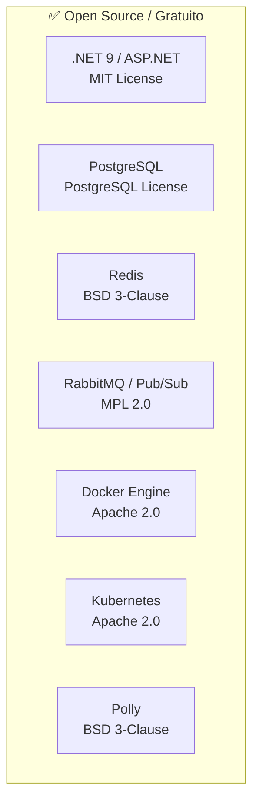
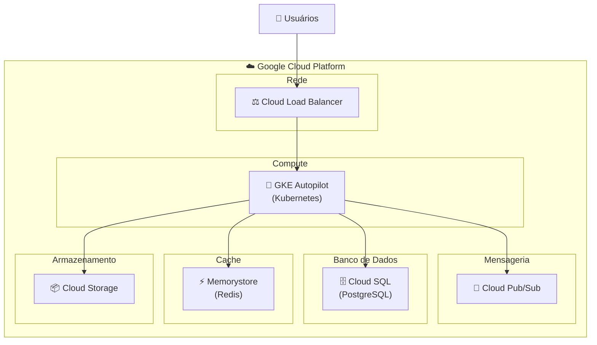
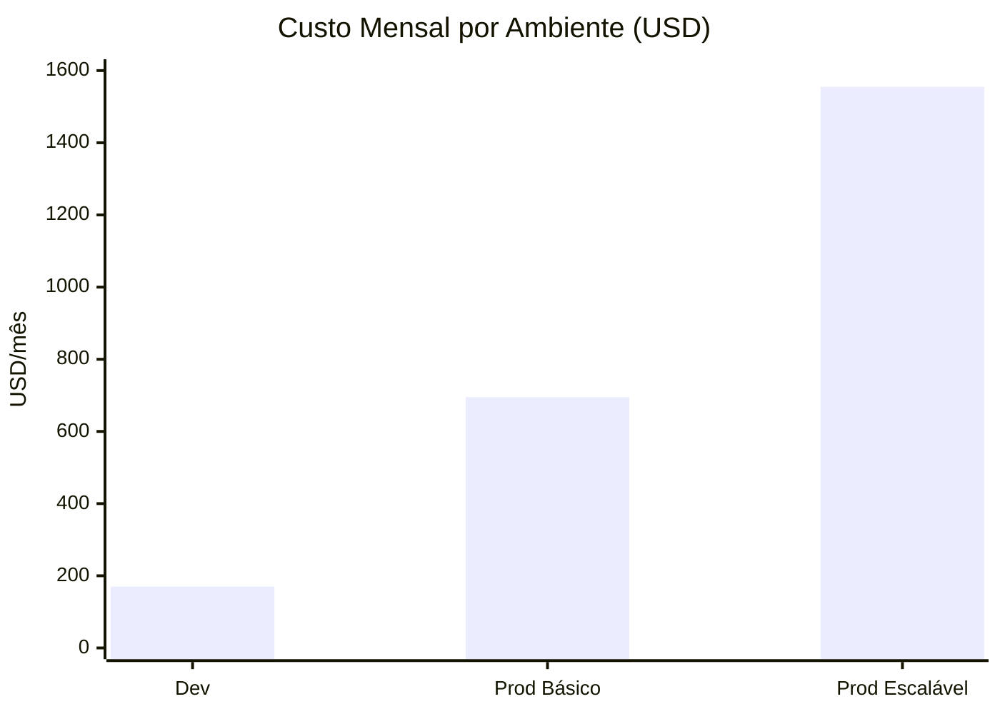
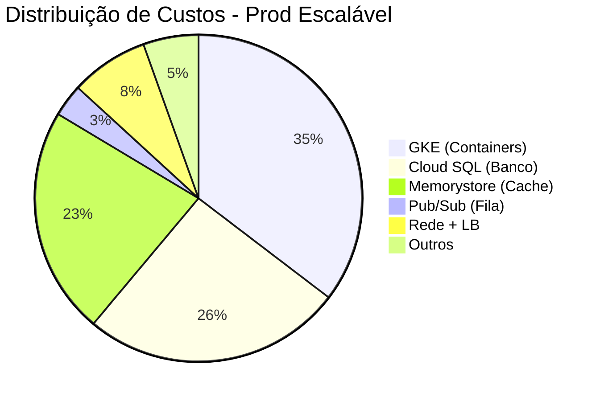
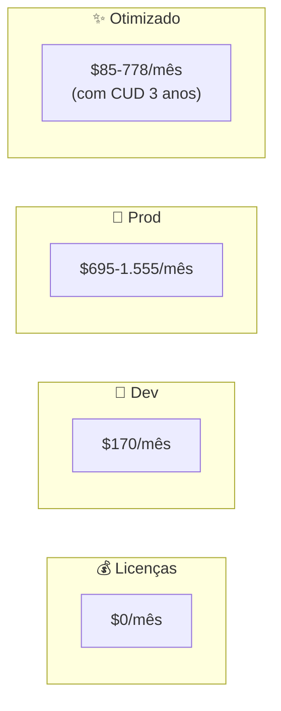

# 💰 Análise de Custos

Este documento apresenta a análise de custos de licenças e infraestrutura para o projeto Cashflow.

## 📋 Resumo Executivo

| Tipo de Custo | Valor |
|---------------|-------|
| **Licenças de Software** | **$0/mês** |
| **Infraestrutura GCP (Dev)** | ~$170/mês |
| **Infraestrutura GCP (Prod)** | ~$695-1.555/mês |

---

## 🆓 Custos de Licença

### Stack 100% Open Source

### Tabela de Licenças

| Ferramenta | Licença | Custo | Observação |
|------------|---------|-------|------------|
| **.NET 9 / ASP.NET** | MIT | **$0** | Open Source da Microsoft |
| **PostgreSQL** | PostgreSQL License | **$0** | Open Source |
| **Redis** | BSD 3-Clause | **$0** | Open Source |
| **RabbitMQ** | MPL 2.0 | **$0** | Open Source (VMware) |
| **Docker Engine** | Apache 2.0 | **$0** | Open Source |
| **Kubernetes** | Apache 2.0 | **$0** | Open Source (CNCF) |
| **Polly** | BSD 3-Clause | **$0** | Open Source |
| **MediatR** | Apache 2.0 | **$0** | Open Source |
| **FluentValidation** | Apache 2.0 | **$0** | Open Source |
| **Serilog** | Apache 2.0 | **$0** | Open Source |
| **xUnit** | Apache 2.0 | **$0** | Open Source |
| **Shouldly** | BSD | **$0** | Open Source |

### ⚠️ Docker Desktop - Atenção!

| Tamanho da Empresa | Licença | Custo |
|--------------------|---------|-------|
| < 250 funcionários **E** < $10M receita | Gratuito | **$0** |
| ≥ 250 funcionários **OU** ≥ $10M receita | Business | **$24/usuário/mês** |

**Alternativas gratuitas ao Docker Desktop:**
- **Podman** - 100% gratuito, compatível com Docker
- **Rancher Desktop** - Gratuito
- **Colima** (macOS) - Gratuito
- **Docker Engine** direto no Linux - Gratuito

---

## ☁️ Custos de Infraestrutura - Google Cloud Platform

### Arquitetura no GCP

---

## 💵 Estimativa por Ambiente

### 🧪 Ambiente de Desenvolvimento

| Serviço | Configuração | Custo/mês |
|---------|--------------|-----------|
| **GKE Autopilot** | 2 vCPU, 4GB RAM | ~$80 |
| **Cloud SQL** | 1 vCPU, 3.75GB, 20GB SSD | ~$35 |
| **Memorystore Redis** | 1GB Basic | ~$35 |
| **Cloud Pub/Sub** | < 10GB/mês | ~$0 (free tier) |
| **Cloud Storage** | 10GB | ~$0.20 |
| **Load Balancer** | 1 regra | ~$18 |
| **Rede (egress)** | ~10GB | ~$1 |

| **TOTAL DEV** | | **~$170/mês** |
|---------------|---|---------------|

---

### 🚀 Ambiente de Produção (Básico)

| Serviço | Configuração | Custo/mês |
|---------|--------------|-----------|
| **GKE Autopilot** | 4 vCPU, 16GB RAM | ~$275 |
| **Cloud SQL** | 2 vCPU, 8GB, 100GB SSD, HA | ~$180 |
| **Memorystore Redis** | 5GB Standard (HA) | ~$175 |
| **Cloud Pub/Sub** | ~100GB/mês | ~$10 |
| **Cloud Storage** | 100GB | ~$2 |
| **Load Balancer** | 3 regras + processamento | ~$35 |
| **Rede (egress)** | ~100GB | ~$12 |
| **Cloud Armor (WAF)** | Básico | ~$5 |

| **TOTAL PROD BÁSICO** | | **~$695/mês** |
|-----------------------|---|---------------|

---

### 🏢 Ambiente de Produção (Escalável - 50 req/s)

| Serviço | Configuração | Custo/mês |
|---------|--------------|-----------|
| **GKE Autopilot** | 8-16 vCPU, 32-64GB RAM (auto-scale) | ~$550 |
| **Cloud SQL** | 4 vCPU, 16GB, 200GB SSD, HA + Read Replica | ~$400 |
| **Memorystore Redis** | 10GB Standard (HA) | ~$350 |
| **Cloud Pub/Sub** | ~500GB/mês | ~$50 |
| **Cloud Storage** | 500GB | ~$10 |
| **Load Balancer** | 5 regras + alto processamento | ~$60 |
| **Rede (egress)** | ~500GB | ~$60 |
| **Cloud Armor (WAF)** | Standard | ~$25 |
| **Cloud Monitoring** | Métricas + Logs | ~$50 |

| **TOTAL PROD ESCALÁVEL** | | **~$1.555/mês** |
|--------------------------|---|-----------------|

---

## 📊 Comparativo Visual

---

## 🔍 Distribuição de Custos

### Produção Escalável

---

## 💲 Preços Unitários GCP

### GKE Autopilot

| Recurso | Preço |
|---------|-------|
| vCPU | $0.0413/vCPU/hora |
| Memória | $0.0046/GB/hora |
| Storage Ephemeral | $0.00005/GB/hora |
| Cluster fee | $0.10/hora |

### Cloud SQL (PostgreSQL)

| Recurso | Preço |
|--------|-------|
| vCPU | $0.0413/vCPU/hora |
| Memória | $0.007/GB/hora |
| SSD Storage | $0.17/GB/mês |
| HA (Alta Disponibilidade) | +100% do custo |
| Read Replica | +100% por réplica |

### Memorystore (Redis)

| Tier | Preço |
|------|-------|
| Basic | $0.035/GB/hora |
| Standard (HA) | $0.070/GB/hora |

### Cloud Pub/Sub

| Recurso | Preço |
|---------|-------|
| Primeiros 10GB/mês | **Gratuito** |
| Acima de 10GB | $0.10/GB |

### Cloud Load Balancer

| Recurso | Preço |
|---------|-------|
| Forwarding rule | $0.025/hora (~$18/mês) |
| Data processing | $0.008/GB |

---

## 💡 Estratégias de Redução de Custos

### 1. Committed Use Discounts (CUD)

| Compromisso | Desconto |
|-------------|----------|
| 1 ano | **~20%** |
| 3 anos | **~50%** |

### 2. Spot/Preemptible VMs

| Uso | Desconto |
|-----|----------|
| Workers tolerantes a interrupção | **Até 80%** |
| Ambientes de desenvolvimento | **Até 80%** |

### 3. Escalar para Zero

- GKE Autopilot escala para zero quando não há carga
- Ideal para ambientes de desenvolvimento/staging

### 4. Free Tier

| Serviço | Free Tier |
|---------|-----------|
| Cloud Pub/Sub | 10GB/mês |
| Cloud Storage | 5GB |
| Cloud Functions | 2M invocações/mês |

---

## 📈 Custos com Otimizações

| Ambiente | Custo Normal | Com CUD 1 ano | Com CUD 3 anos |
|----------|--------------|---------------|----------------|
| **Desenvolvimento** | $170/mês | $136/mês | $85/mês |
| **Produção Básica** | $695/mês | $556/mês | $348/mês |
| **Produção Escalável** | $1.555/mês | $1.244/mês | $778/mês |

### Com Spot VMs para Workers

| Ambiente | Custo Normal | Com Spot Workers |
|----------|--------------|------------------|
| **Desenvolvimento** | $170/mês | ~$100/mês |
| **Produção Escalável** | $1.555/mês | ~$1.200/mês |

---

## 📋 Resumo Final

| Cenário | Custo Mensal | Custo Anual |
|---------|--------------|-------------|
| **Dev (normal)** | $170 | $2.040 |
| **Dev (otimizado)** | $85 | $1.020 |
| **Prod Básico (normal)** | $695 | $8.340 |
| **Prod Básico (CUD 3y)** | $348 | $4.176 |
| **Prod Escalável (normal)** | $1.555 | $18.660 |
| **Prod Escalável (CUD 3y)** | $778 | $9.336 |

---

## 🧮 Calculadora Oficial

Para estimativas personalizadas:

🔗 [Google Cloud Pricing Calculator](https://cloud.google.com/products/calculator)

---

## 📚 Referências

- [GCP Pricing Overview](https://cloud.google.com/pricing)
- [GKE Autopilot Pricing](https://cloud.google.com/kubernetes-engine/pricing)
- [Cloud SQL Pricing](https://cloud.google.com/sql/pricing)
- [Memorystore Pricing](https://cloud.google.com/memorystore/docs/redis/pricing)
- [Committed Use Discounts](https://cloud.google.com/compute/docs/instances/signing-up-committed-use-discounts)

