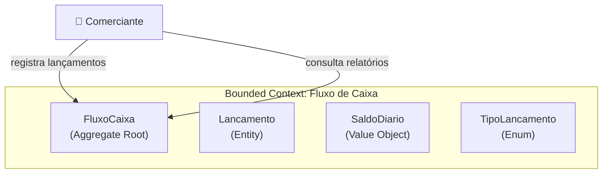
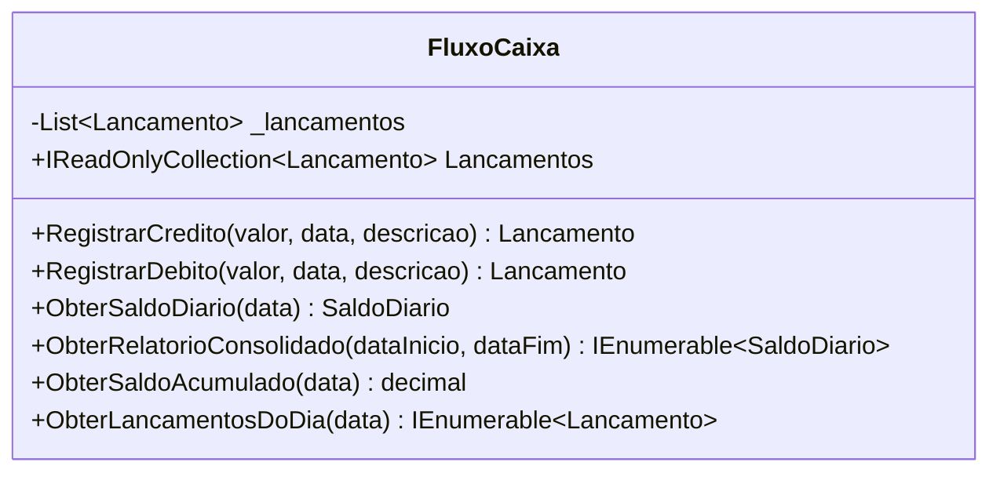
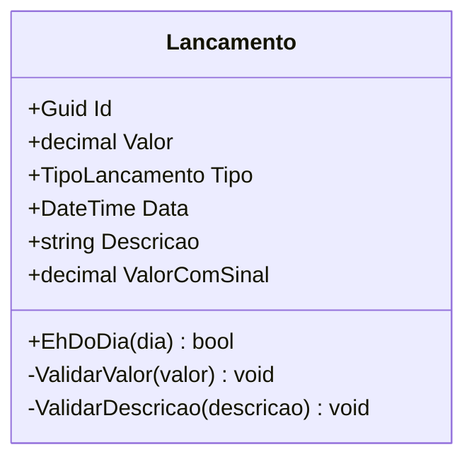
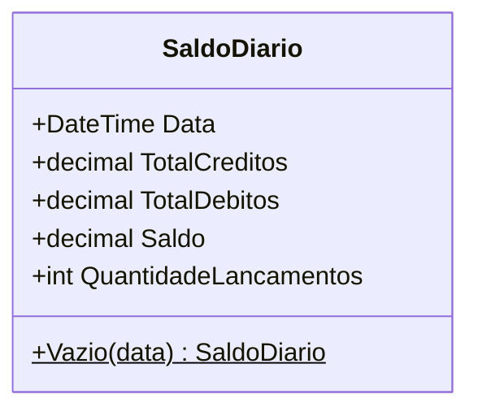
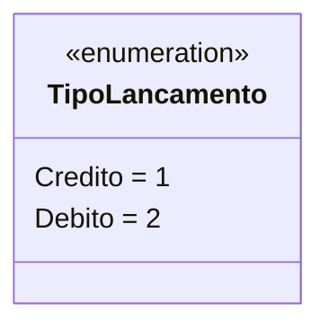
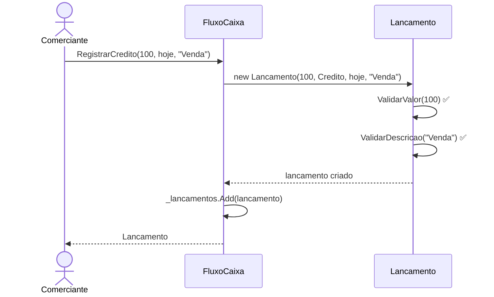
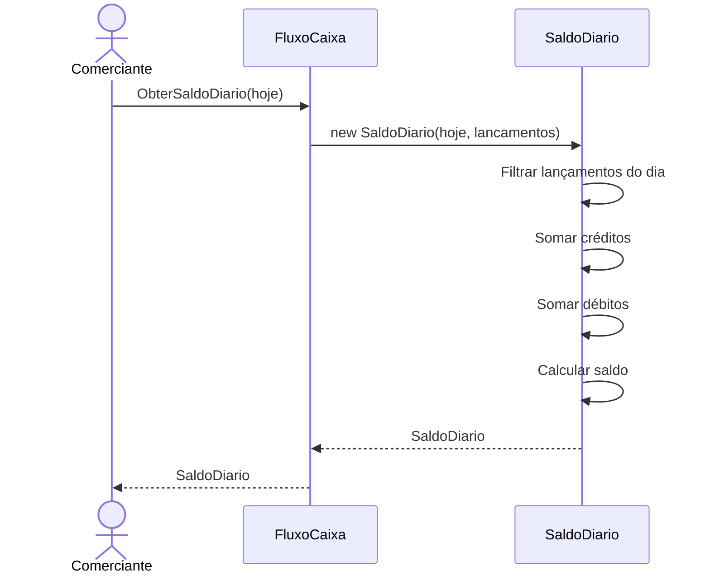
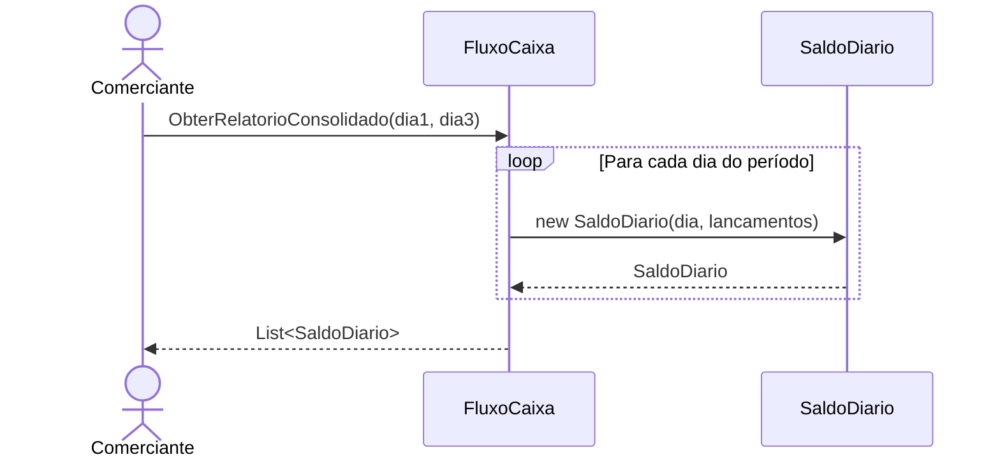

# 🎯 Domínio - Modelagem DDD

Este documento detalha a modelagem de domínio do projeto Cashflow, seguindo os princípios do Domain-Driven Design (DDD).

## 📖 Contexto de Negócio

> *"Um comerciante precisa controlar o seu fluxo de caixa diário com os lançamentos (débito e crédito), também precisa de um relatório que disponibiliza o saldo diário consolidado."*

## 🗺️ Mapa de Contexto



## 🧩 Building Blocks do DDD

### Aggregate Root: FluxoCaixa

O `FluxoCaixa` é o ponto de entrada para todas as operações do domínio.



**Responsabilidades:**
- Gerenciar a coleção de lançamentos
- Garantir consistência das operações
- Gerar relatórios consolidados

**Por que é um Aggregate Root?**
- É o ponto único de acesso para criar lançamentos
- Protege invariantes do domínio
- Controla o ciclo de vida dos lançamentos

### Entity: Lancamento

O `Lancamento` representa cada movimentação financeira no caixa.



**Características de Entidade:**
- Possui **identidade única** (`Id`)
- Duas instâncias com mesmos atributos mas IDs diferentes são **diferentes**
- Mantém estado e comportamento

**Invariantes:**
- Valor deve ser maior que zero
- Descrição é obrigatória
- Data não pode ser alterada após criação

### Value Object: SaldoDiario

O `SaldoDiario` representa o saldo consolidado de um dia específico.



**Características de Value Object:**
- **Sem identidade** - definido apenas por seus atributos
- **Imutável** - não pode ser alterado após criação
- Duas instâncias com mesmos valores são **iguais**
- Pode ser substituído, não modificado

**Por que é um Value Object?**
- Representa um conceito descritivo (o saldo de um dia)
- Não precisa ser rastreado por identidade
- É calculado a partir dos lançamentos

### Enumeration: TipoLancamento



**Semântica:**
- `Credito`: Entrada de dinheiro (aumenta saldo)
- `Debito`: Saída de dinheiro (diminui saldo)

## 🔄 Fluxos de Domínio

### Registrar Lançamento



### Obter Saldo Diário



### Gerar Relatório Consolidado



## 📏 Regras de Negócio por Entidade

### Lancamento

| Código | Regra | Validação |
|--------|-------|-----------|
| RN01 | Valor maior que zero | `ValidarValor()` |
| RN02 | Descrição obrigatória | `ValidarDescricao()` |
| RN03 | Tipo válido (Crédito/Débito) | Enum fortemente tipado |
| RN04 | Data associada | Parâmetro obrigatório |

### SaldoDiario

| Código | Regra | Implementação |
|--------|-------|---------------|
| RN07 | Saldo = Créditos - Débitos | Propriedade calculada |
| RN08 | Considera apenas lançamentos do dia | Filtro por `EhDoDia()` |

### FluxoCaixa

| Código | Regra | Implementação |
|--------|-------|---------------|
| RN09 | Dias sem lançamentos têm saldo zero | `ObterRelatorioConsolidado()` |
| RN13 | DataInício <= DataFim | Validação no método |

## 🎨 Linguagem Ubíqua

Glossário de termos do domínio:

| Termo | Definição |
|-------|-----------|
| **Lançamento** | Registro de movimentação financeira (entrada ou saída) |
| **Crédito** | Entrada de dinheiro no caixa |
| **Débito** | Saída de dinheiro do caixa |
| **Saldo** | Diferença entre créditos e débitos |
| **Saldo Diário** | Consolidação de todas as movimentações de um dia |
| **Saldo Acumulado** | Soma de todos os lançamentos até uma data |
| **Fluxo de Caixa** | Controle de entradas e saídas financeiras |
| **Relatório Consolidado** | Visão do saldo diário para um período |

## 🏗️ Decisões de Design

### 1. Por que `ValorComSinal` no Lancamento?

```csharp
public decimal ValorComSinal => Tipo == TipoLancamento.Credito ? Valor : -Valor;
```

**Motivo:** Facilita cálculos de saldo sem precisar verificar o tipo a cada soma.

### 2. Por que `EhDoDia()` como método?

```csharp
public bool EhDoDia(DateTime dia) => Data.Date == dia.Date;
```

**Motivo:** Encapsula a lógica de comparação de datas (ignora hora), expressando a intenção do domínio.

### 3. Por que data é armazenada apenas como Date?

```csharp
Data = data.Date;  // Remove componente de hora
```

**Motivo:** O domínio trabalha com saldo **diário**, a hora não é relevante para o negócio.

### 4. Por que construtor privado vazio nas entidades?

```csharp
private Lancamento() { }
```

**Motivo:** Permite uso futuro de ORMs (Entity Framework) sem expor construtor público.

## 📚 Referências

- [Domain-Driven Design Reference - Eric Evans](https://www.domainlanguage.com/ddd/reference/)
- [Implementing Domain-Driven Design - Vaughn Vernon](https://www.amazon.com/Implementing-Domain-Driven-Design-Vaughn-Vernon/dp/0321834577)
- [DDD Building Blocks](https://martinfowler.com/bliki/EvansClassification.html)

