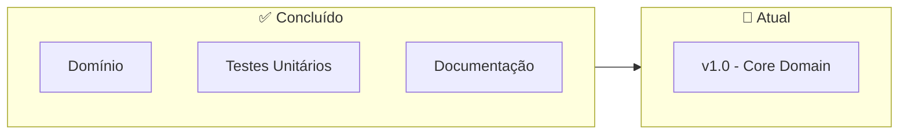
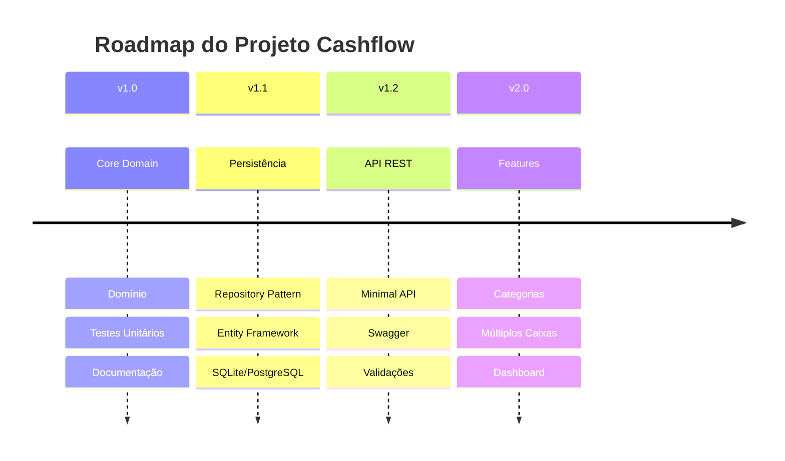
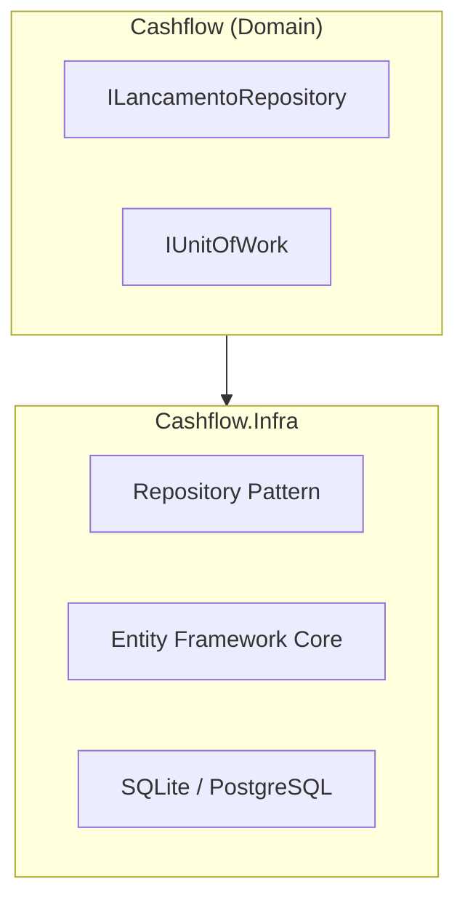
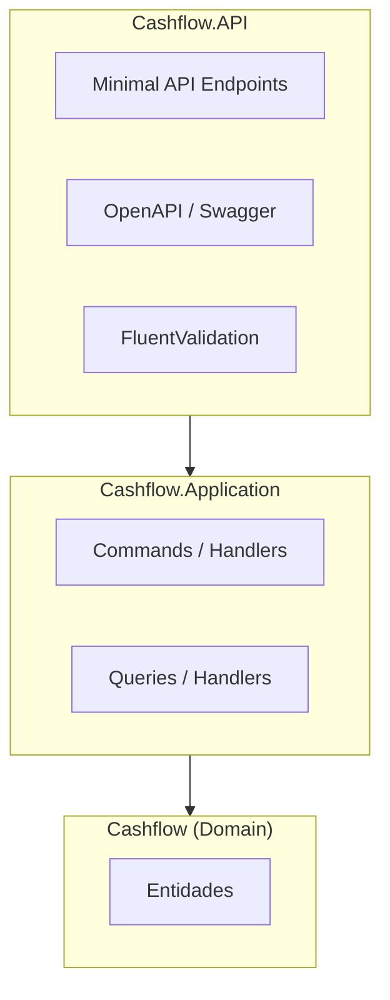
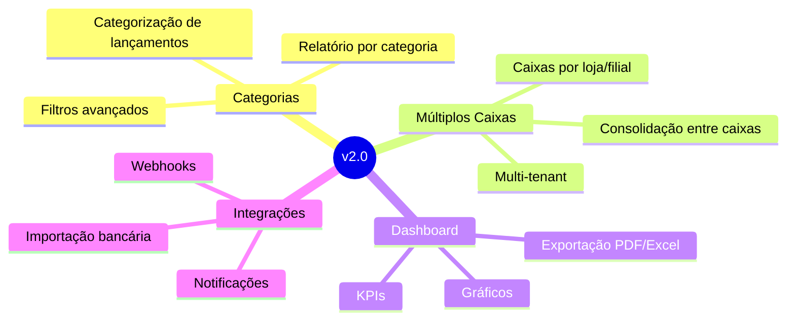
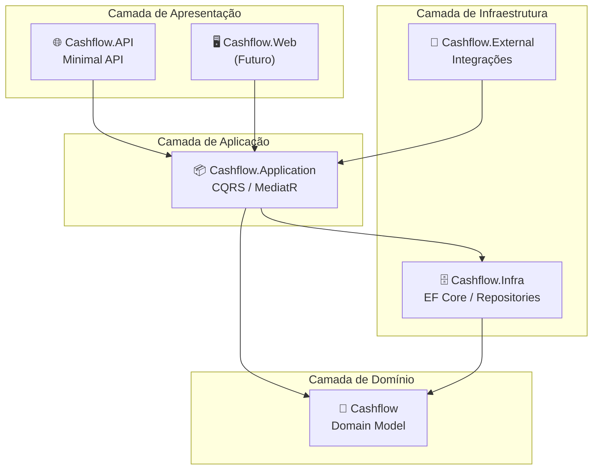

# 🔮 Roadmap

Este documento apresenta a visão de evolução do projeto Cashflow, com os próximos passos planejados e funcionalidades futuras.

## 📍 Status Atual

### v1.0 - Core Domain ✅

- [x] Modelagem de domínio (DDD)
- [x] Entidade `Lancamento`
- [x] Value Object `SaldoDiario`
- [x] Agregado `FluxoCaixa`
- [x] Testes unitários (26 testes)
- [x] Documentação inicial

## 🗺️ Visão de Evolução

## 📋 Backlog Detalhado

### v1.1 - Persistência

**Tarefas:**

- [ ] Criar projeto `Cashflow.Infra`
- [ ] Implementar `ILancamentoRepository`
- [ ] Implementar `IFluxoCaixaRepository`
- [ ] Configurar Entity Framework Core
- [ ] Criar migrations
- [ ] Testes de integração com banco

**Padrões a implementar:**
- Repository Pattern
- Unit of Work
- Specification Pattern (opcional)

### v1.2 - API REST

**Endpoints planejados:**

| Método | Rota | Descrição |
|--------|------|-----------|
| `POST` | `/lancamentos` | Registrar lançamento |
| `GET` | `/lancamentos` | Listar lançamentos |
| `GET` | `/lancamentos/{id}` | Obter lançamento |
| `GET` | `/saldo/diario/{data}` | Saldo do dia |
| `GET` | `/saldo/acumulado/{data}` | Saldo acumulado |
| `GET` | `/relatorio?inicio={}&fim={}` | Relatório consolidado |

**Tarefas:**

- [ ] Criar projeto `Cashflow.API`
- [ ] Criar projeto `Cashflow.Application` (opcional)
- [ ] Implementar endpoints
- [ ] Configurar Swagger/OpenAPI
- [ ] Implementar validações
- [ ] Tratamento de erros global
- [ ] Testes de integração da API

### v2.0 - Features Avançadas

**Features planejadas:**

| Feature | Descrição | Prioridade |
|---------|-----------|------------|
| Categorias | Classificar lançamentos por categoria | Alta |
| Múltiplos Caixas | Suporte a mais de um caixa | Alta |
| Dashboard | Visualização gráfica dos dados | Média |
| Exportação | PDF, Excel, CSV | Média |
| Importação | Integração com extratos bancários | Baixa |
| Notificações | Alertas de saldo baixo | Baixa |

## 🏗️ Arquitetura Futura

## 📊 Métricas de Qualidade

### Metas

| Métrica | Meta | Atual |
|---------|------|-------|
| Cobertura de Testes | > 80% | ~90% |
| Complexidade Ciclomática | < 10 | ✅ |
| Duplicação de Código | < 3% | ✅ |
| Débito Técnico | Baixo | ✅ |

### Ferramentas Planejadas

- [ ] SonarQube para análise estática
- [ ] GitHub Actions para CI/CD
- [ ] Coverlet para cobertura de código

## 🎯 Critérios de Pronto (Definition of Done)

Para cada feature ser considerada **pronta**:

- [ ] Código implementado e revisado
- [ ] Testes unitários escritos (cobertura > 80%)
- [ ] Testes de integração (quando aplicável)
- [ ] Documentação atualizada
- [ ] Sem erros de linter/análise estática
- [ ] Build passando no CI
- [ ] Code review aprovado

## 💡 Ideias Futuras

Funcionalidades para considerar no futuro:

1. **Previsão de Fluxo de Caixa** - ML para prever entradas/saídas
2. **Reconciliação Bancária** - Comparar com extrato do banco
3. **Multi-moeda** - Suporte a diferentes moedas
4. **Auditoria** - Log de todas as alterações
5. **API Pública** - Para integrações externas
6. **Mobile App** - Aplicativo para consulta rápida

## 📅 Timeline Estimada

| Versão | Escopo | Estimativa |
|--------|--------|------------|
| v1.0 | Core Domain | ✅ Concluído |
| v1.1 | Persistência | 2-3 semanas |
| v1.2 | API REST | 2-3 semanas |
| v2.0 | Features | 4-6 semanas |

> **Nota:** Estimativas são aproximadas e podem variar conforme disponibilidade e complexidade encontrada.

## 🤝 Contribuindo

Quer contribuir com o projeto? Veja como:

1. Escolha uma tarefa do backlog
2. Crie uma branch: `feature/nome-da-feature`
3. Implemente seguindo os padrões do projeto
4. Escreva testes
5. Abra um Pull Request

## 📚 Referências

- [Clean Architecture](https://blog.cleancoder.com/uncle-bob/2012/08/13/the-clean-architecture.html)
- [CQRS Pattern](https://docs.microsoft.com/en-us/azure/architecture/patterns/cqrs)
- [Minimal APIs](https://docs.microsoft.com/en-us/aspnet/core/fundamentals/minimal-apis)

