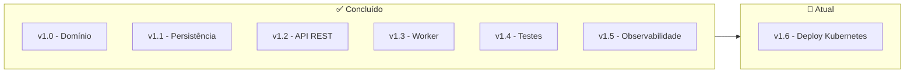
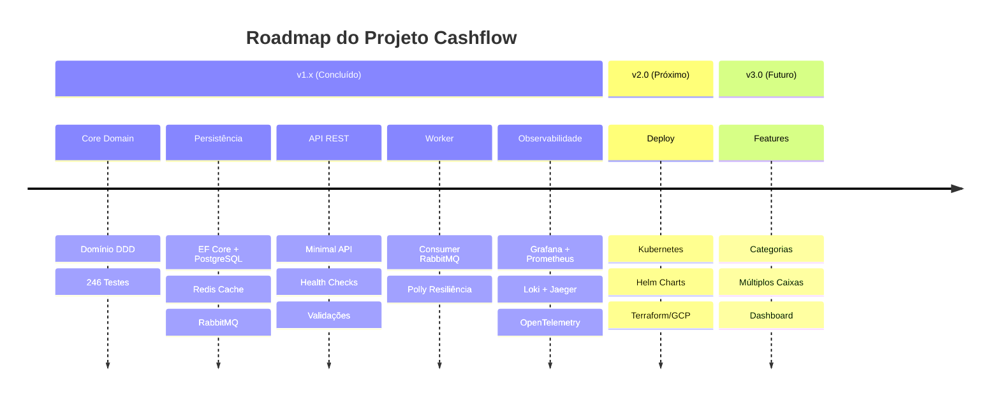
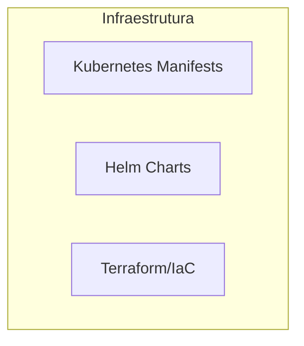
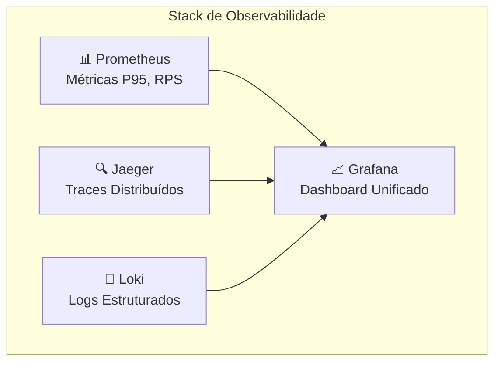
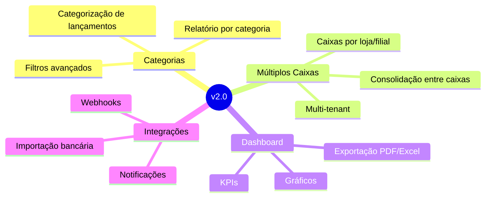
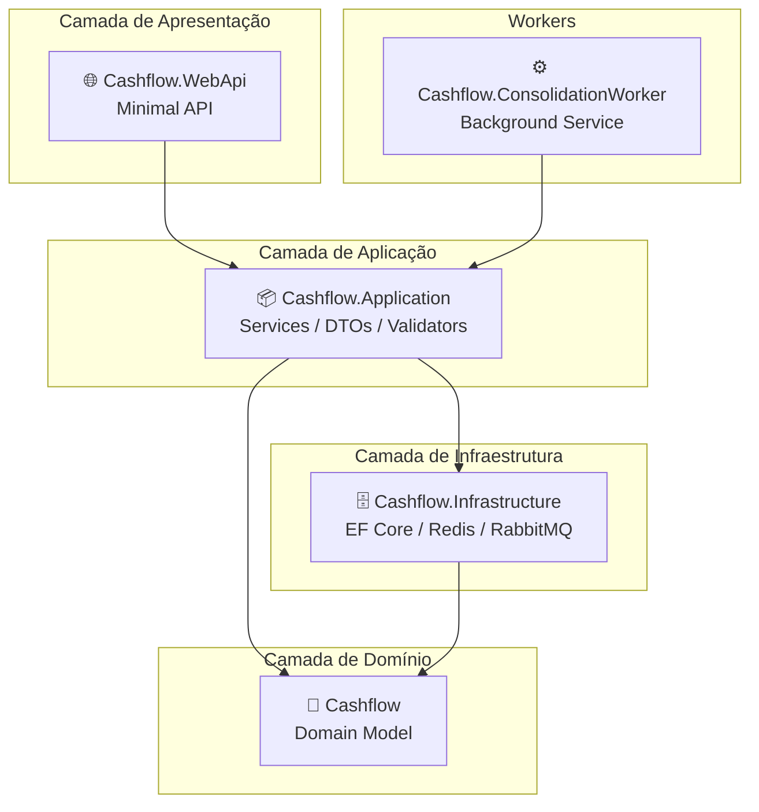

# 🔮 Roadmap

Este documento apresenta a visão de evolução do projeto Cashflow, com os próximos passos planejados e funcionalidades futuras.

## 📍 Status Atual

### v1.0 - Core Domain ✅

- [x] Modelagem de domínio (DDD)
- [x] Entidade `Lancamento`
- [x] Value Object `SaldoDiario`
- [x] Agregado `FluxoCaixa`
- [x] Testes unitários do domínio (26 testes)
- [x] Documentação inicial

### v1.1 - Persistência ✅

- [x] Criar projeto `Cashflow.Infrastructure`
- [x] Implementar `ILancamentoRepository`
- [x] Implementar `ISaldoConsolidadoRepository`
- [x] Configurar Entity Framework Core
- [x] Configurar PostgreSQL
- [x] Configurar Redis Cache
- [x] Configurar RabbitMQ

### v1.2 - API REST ✅

- [x] Criar projeto `Cashflow.WebApi` (Minimal API)
- [x] Criar projeto `Cashflow.Application`
- [x] Implementar endpoints de Lançamentos
- [x] Implementar endpoints de Consolidado
- [x] Configurar Health Checks
- [x] Implementar validações com FluentValidation
- [x] Tratamento de erros global

### v1.3 - Worker de Consolidação ✅

- [x] Criar projeto `Cashflow.ConsolidationWorker`
- [x] Implementar consumer RabbitMQ
- [x] Implementar Polly para resiliência (retry, circuit breaker)
- [x] Health check via arquivo para Docker
- [x] Configuração de logging com Serilog

### v1.4 - Testes ✅

- [x] Testes unitários do domínio (83 testes)
- [x] Testes unitários da Application (120 testes)
- [x] Testes de integração com Testcontainers (43 testes)
- [x] Testes de performance com K6 (55 RPS, P95 < 100ms)
- [x] CI/CD com GitHub Actions
- [x] Configuração para WSL/Docker

### v1.5 - Observabilidade ✅

- [x] OpenTelemetry para traces distribuídos
- [x] Prometheus para métricas (P95, RPS, Error Rate)
- [x] Loki para logs estruturados
- [x] Jaeger para visualização de traces
- [x] Grafana para dashboards unificados
- [x] Serilog com exportação para Loki
- [x] Documentação de observabilidade

## 📊 Resumo de Testes

| Projeto | Testes | Status |
|---------|--------|--------|
| `Cashflow.Tests` | 83 | ✅ |
| `Cashflow.Application.Tests` | 120 | ✅ |
| `Cashflow.IntegrationTests` | 43 (5 skipped) | ✅ |
| `tests/k6` | 4 scripts | ✅ |
| **Total** | **246 + K6** | ✅ |

## 🗺️ Visão de Evolução

## 📋 Backlog Detalhado

### v1.6 - Deploy Kubernetes 🔄

**Tarefas:**

- [ ] Criar manifestos Kubernetes
- [ ] Configurar Helm Charts
- [ ] Terraform para GCP
- [ ] CI/CD para deploy automático

### Observabilidade ✅ (Concluído)

**Implementado:**

- [x] OpenTelemetry na API e Worker
- [x] Prometheus para métricas
- [x] Jaeger para traces distribuídos
- [x] Loki para logs estruturados
- [x] Grafana com dashboard pré-configurado
- [x] Serilog exportando para Loki
- [x] ~~docker-compose.observability.yml~~ (Observabilidade integrada ao `docker-compose.yml` principal com perfil `observability`)

### v2.0 - Features Avançadas

**Features planejadas:**

| Feature | Descrição | Prioridade |
|---------|-----------|------------|
| Categorias | Classificar lançamentos por categoria | Alta |
| Múltiplos Caixas | Suporte a mais de um caixa | Alta |
| Dashboard | Visualização gráfica dos dados | Média |
| Exportação | PDF, Excel, CSV | Média |
| Importação | Integração com extratos bancários | Baixa |
| Notificações | Alertas de saldo baixo | Baixa |

## 🏗️ Arquitetura Implementada

## 📊 Métricas de Qualidade

### Metas

| Métrica | Meta | Atual |
|---------|------|-------|
| Cobertura de Testes | > 80% | ✅ ~95% |
| Complexidade Ciclomática | < 10 | ✅ |
| Duplicação de Código | < 3% | ✅ |
| Débito Técnico | Baixo | ✅ |
| Testes Passando | 100% | ✅ 246/251 |
| P95 Latency | < 100ms | ✅ Monitorado |
| Error Rate | < 5% | ✅ Monitorado |

### Ferramentas Implementadas

- [x] GitHub Actions para CI/CD
- [x] Testcontainers para testes de integração
- [x] Docker multi-stage builds
- [x] K6 para testes de performance
- [x] OpenTelemetry para tracing
- [x] Prometheus para métricas
- [x] Grafana para dashboards
- [x] Jaeger para traces
- [x] Loki para logs
- [x] Release automático no CI
- [ ] SonarQube para análise estática
- [ ] Codecov para cobertura de código

## 🎯 Critérios de Pronto (Definition of Done)

Para cada feature ser considerada **pronta**:

- [x] Código implementado e revisado
- [x] Testes unitários escritos (cobertura > 80%)
- [x] Testes de integração (quando aplicável)
- [x] Documentação atualizada
- [x] Sem erros de linter/análise estática
- [x] Build passando no CI
- [x] Docker build funcionando

## 💡 Ideias Futuras

Funcionalidades para considerar no futuro:

1. **Previsão de Fluxo de Caixa** - ML para prever entradas/saídas
2. **Reconciliação Bancária** - Comparar com extrato do banco
3. **Multi-moeda** - Suporte a diferentes moedas
4. **Auditoria** - Log de todas as alterações
5. **API Pública** - Para integrações externas
6. **Mobile App** - Aplicativo para consulta rápida

## 📅 Timeline

| Versão | Escopo | Status |
|--------|--------|--------|
| v1.0 | Core Domain | ✅ Concluído |
| v1.1 | Persistência | ✅ Concluído |
| v1.2 | API REST | ✅ Concluído |
| v1.3 | Worker | ✅ Concluído |
| v1.4 | Testes (246 testes) | ✅ Concluído |
| v1.5 | Observabilidade (Grafana, Prometheus, Loki, Jaeger) | ✅ Concluído |
| v1.6 | Deploy Kubernetes | 🔄 Em andamento |
| v2.0 | Features Avançadas | ⏳ Planejado |

## 🤝 Contribuindo

Quer contribuir com o projeto? Veja como:

1. Escolha uma tarefa do backlog
2. Crie uma branch: `feature/nome-da-feature`
3. Implemente seguindo os padrões do projeto
4. Escreva testes
5. Abra um Pull Request

## 📚 Referências

- [Clean Architecture](https://blog.cleancoder.com/uncle-bob/2012/08/13/the-clean-architecture.html)
- [CQRS Pattern](https://docs.microsoft.com/en-us/azure/architecture/patterns/cqrs)
- [Minimal APIs](https://docs.microsoft.com/en-us/aspnet/core/fundamentals/minimal-apis)
- [Testcontainers](https://testcontainers.com/)
- [Polly Resilience](https://github.com/App-vNext/Polly)
