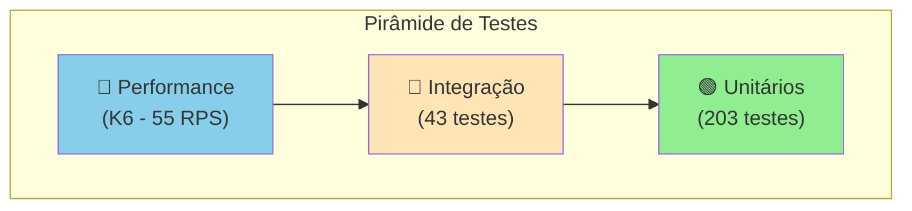
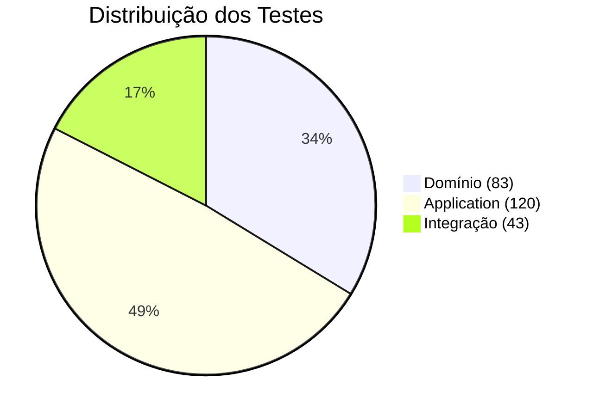

# 🧪 Estratégia de Testes

Este documento descreve a estratégia de testes adotada no projeto Cashflow, incluindo padrões, ferramentas e boas práticas.

## 🛠️ Stack de Testes

| Ferramenta | Propósito | Versão |
|------------|-----------|--------|
| **xUnit** | Framework de testes | 2.9.2 |
| **Shouldly** | Assertions fluentes | 4.3.0 |
| **Moq** | Mocking framework | 4.20.72 |
| **Testcontainers** | Containers para integração | 4.3.0 |
| **K6** | Testes de performance | latest |
| **Coverlet** | Cobertura de código | 6.0.2 |

## 📐 Pirâmide de Testes



**Situação Atual:**
- ✅ **Testes Unitários**: 203 testes (83 Domínio + 120 Application)
- ✅ **Testes de Integração**: 43 testes (Testcontainers)
- ✅ **Testes de Performance**: K6 (55 RPS, P95 < 100ms)

## 📊 Resumo de Cobertura

| Projeto | Testes | Tipo |
|---------|--------|------|
| `Cashflow.Tests` | 83 | Unitário (Domínio) |
| `Cashflow.Application.Tests` | 120 | Unitário (Application) |
| `Cashflow.IntegrationTests` | 43 | Integração (API + DB) |
| `tests/k6` | 4 scripts | Performance (K6) |
| **Total** | **246 + K6** | - |

### Por Camada



## 🎯 Padrão AAA (Arrange-Act-Assert)

Todos os testes seguem o padrão AAA:

```csharp
[Fact]
public void Deve_Criar_Lancamento_De_Credito_Com_Sucesso()
{
    // Arrange - Preparação
    var valor = 100.50m;
    var tipo = TipoLancamento.Credito;
    var data = new DateTime(2024, 1, 15);
    var descricao = "Venda de produto";

    // Act - Execução
    var lancamento = new Lancamento(valor, tipo, data, descricao);

    // Assert - Verificação
    lancamento.Id.ShouldNotBe(Guid.Empty);
    lancamento.Valor.ShouldBe(valor);
    lancamento.Tipo.ShouldBe(tipo);
}
```

## 📝 Convenção de Nomenclatura

### Padrão Adotado

```
Deve_[Comportamento]_Quando_[Cenário]
```

ou

```
[Método]_Deve_[Resultado]_[Condição]
```

### Exemplos

```csharp
// ✅ Bons nomes
Deve_Criar_Lancamento_De_Credito_Com_Sucesso()
Deve_Lancar_Excecao_Quando_Valor_For_Invalido()
ValorComSinal_Deve_Ser_Positivo_Para_Credito()
CriarAsync_DevePublicarEvento_QuandoSucesso()

// ❌ Nomes a evitar
TesteLancamento()
Test1()
LancamentoValido()
```

## 🧪 Tipos de Teste

### 1. Testes de Domínio (Cashflow.Tests)

Testam as regras de negócio no domínio:

```csharp
[Fact]
public void Deve_Criar_Lancamento_De_Credito_Com_Sucesso()
{
    var lancamento = new Lancamento(100m, TipoLancamento.Credito, DateTime.Today, "Venda");
    
    lancamento.ValorComSinal.ShouldBe(100m);
}

[Theory]
[InlineData(0)]
[InlineData(-1)]
public void Deve_Lancar_Excecao_Quando_Valor_For_Invalido(decimal valorInvalido)
{
    Should.Throw<ArgumentException>(() =>
        new Lancamento(valorInvalido, TipoLancamento.Credito, DateTime.Today, "Teste"));
}
```

### 2. Testes de Application (Cashflow.Application.Tests)

Testam os serviços da camada de aplicação com mocks:

```csharp
[Fact]
public async Task CriarAsync_DeveRetornarSucesso_QuandoDadosValidos()
{
    // Arrange
    var request = new CriarLancamentoRequest(100m, TipoLancamento.Credito, DateTime.Today, "Teste");
    _repositoryMock.Setup(r => r.AddAsync(It.IsAny<Lancamento>(), default))
        .Returns(Task.CompletedTask);
    _publisherMock.Setup(p => p.PublishAsync(It.IsAny<LancamentoCriadoEvent>(), default))
        .Returns(Task.CompletedTask);

    // Act
    var result = await _service.CriarAsync(request);

    // Assert
    result.IsSuccess.ShouldBeTrue();
    result.Value.ShouldNotBeNull();
}
```

### 3. Testes de Integração (Cashflow.IntegrationTests)

Testam a API completa com banco real via Testcontainers:

```csharp
[Fact]
public async Task CriarLancamento_DeveRetornarCreated_QuandoDadosValidos()
{
    // Arrange
    var request = new { Valor = 100m, Tipo = 0, Data = DateTime.Today, Descricao = "Teste" };

    // Act
    var response = await _client.PostAsJsonAsync("/api/lancamentos", request);

    // Assert
    response.StatusCode.ShouldBe(HttpStatusCode.Created);
}
```

## 🐳 Testcontainers

Os testes de integração usam Testcontainers para criar containers efêmeros:

```csharp
public class PostgreSqlContainerFixture : IAsyncLifetime
{
    private readonly PostgreSqlContainer _container = new PostgreSqlBuilder()
        .WithImage("postgres:16-alpine")
        .WithDatabase("cashflow_test")
        .Build();

    public async Task InitializeAsync() => await _container.StartAsync();
    public async Task DisposeAsync() => await _container.DisposeAsync();
}
```

### Containers Utilizados

| Container | Imagem | Propósito |
|-----------|--------|-----------|
| **PostgreSQL** | `postgres:16-alpine` | Banco de dados |
| **Redis** | `redis:7-alpine` | Cache |
| **RabbitMQ** | `rabbitmq:3-management-alpine` | Mensageria |

### Configuração para WSL

Para executar no Windows com WSL:

```properties
# ~/.testcontainers.properties
docker.host=tcp://localhost:2375
```

Ou via `test.runsettings`:

```xml
<RunSettings>
  <RunConfiguration>
    <EnvironmentVariables>
      <DOCKER_HOST>tcp://localhost:2375</DOCKER_HOST>
    </EnvironmentVariables>
  </RunConfiguration>
</RunSettings>
```

## 🏃 Executando os Testes

### Comandos

```bash
# Executar todos os testes
dotnet test

# Testes unitários apenas
dotnet test tests/Cashflow.Tests
dotnet test tests/Cashflow.Application.Tests

# Testes de integração (requer Docker)
dotnet test tests/Cashflow.IntegrationTests --settings tests/Cashflow.IntegrationTests/test.runsettings

# Com detalhes
dotnet test --verbosity detailed

# Com cobertura
dotnet test --collect:"XPlat Code Coverage"

# Filtrar por classe
dotnet test --filter "FullyQualifiedName~LancamentoTests"
```

### Resultado Esperado

```
Execução de Teste Bem-sucedida.
Total de testes: 251
     Aprovados: 246
     Ignorados: 5
```

## 📁 Estrutura de Testes

```
tests/
├── Cashflow.Tests/                      # Testes de Domínio
│   ├── LancamentoTests.cs               # Testes da entidade
│   ├── SaldoDiarioTests.cs              # Testes do Value Object
│   └── FluxoCaixaTests.cs               # Testes do agregado
│
├── Cashflow.Application.Tests/          # Testes de Application
│   ├── Services/
│   │   ├── LancamentoServiceTests.cs    # 19 testes
│   │   └── ConsolidadoServiceTests.cs   # 12 testes
│   └── Validators/
│       └── CriarLancamentoValidatorTests.cs  # 15 testes
│
└── Cashflow.IntegrationTests/           # Testes de Integração
    ├── Fixtures/                        # Configuração de containers
    │   ├── PostgreSqlContainerFixture.cs
    │   ├── RedisContainerFixture.cs
    │   ├── RabbitMqContainerFixture.cs
    │   └── WebApiFixture.cs
    ├── Endpoints/                       # Testes de endpoints
    │   ├── LancamentosEndpointsTests.cs
    │   ├── ConsolidadoEndpointsTests.cs
    │   └── HealthEndpointTests.cs
    ├── Repositories/                    # Testes de repositórios
    │   └── LancamentoRepositoryTests.cs
    └── Cache/                           # Testes de cache
        └── RedisCacheServiceTests.cs
```

## ✅ Cenários Cobertos

### Domínio (83 testes)

| Classe | Cenários |
|--------|----------|
| **Lancamento** | Criação, validação, ValorComSinal, EhDoDia, edge cases |
| **SaldoDiario** | Cálculo, filtro por dia, normalização, edge cases |
| **FluxoCaixa** | Registrar, consolidar, relatório, acumulado |
| **DomainConstants** | Validação de todas as constantes |
| **TipoLancamento** | Conversão, parsing, valores válidos |
| **LancamentoCriadoEvent** | Criação e mapeamento |

### Application (120 testes)

| Classe | Cenários |
|--------|----------|
| **LancamentoService** | CRUD, validação, publicação de eventos |
| **ConsolidadoService** | Cálculo, período, recálculo |
| **CriarLancamentoValidator** | Todas as regras de validação + edge cases |
| **DTOs** | LancamentoResponse, SaldoConsolidadoResponse, paginação |
| **Result Pattern** | Success, Failure, erros múltiplos |

### Integração (43 testes)

| Área | Cenários |
|------|----------|
| **Endpoints** | Todos os endpoints da API |
| **Repositories** | CRUD com PostgreSQL real |
| **Cache** | Operações com Redis real |
| **Health** | Health checks funcionando |

## 🚀 Testes de Performance (K6)

Os testes de performance validam os requisitos não-funcionais usando K6.

### Scripts Disponíveis

| Script | Descrição | Requisitos |
|--------|-----------|------------|
| `smoke-test.js` | Validação rápida (30s) | API funcionando |
| `consolidado-load-test.js` | Carga sustentada 55 RPS | P95 < 100ms |
| `lancamentos-load-test.js` | CRUD misto (70% leitura) | - |
| `stress-test.js` | Encontrar limite da API | - |

### Configuração Principal

```javascript
// consolidado-load-test.js
export const options = {
    scenarios: {
        sustained_load: {
            executor: 'constant-arrival-rate',
            rate: 55,                    // 55 RPS (10% acima do requisito)
            timeUnit: '1s',
            duration: '2m',
        },
    },
    thresholds: {
        'http_req_duration': ['p(95)<100'],  // 95% < 100ms
        'http_req_failed': ['rate<0.05'],    // < 5% falhas
    },
};
```

### Como Executar

```bash
# Instalar K6
winget install k6 --source winget

# Smoke test (rápido)
k6 run tests/k6/smoke-test.js

# Load test (55 RPS)
k6 run tests/k6/consolidado-load-test.js

# Stress test
k6 run tests/k6/stress-test.js
```

### CI/CD

Os testes K6 rodam automaticamente no GitHub Actions como parte do pipeline CI/CD na branch `main`:

```yaml
# .github/workflows/ci.yml (job: performance-tests)
performance-tests:
  name: Performance Tests (K6)
  needs: [unit-tests, integration-tests]
  if: github.event_name == 'push' && github.ref == 'refs/heads/main'
```

Após todos os jobs passarem, um **release automático** é criado com a versão incrementada.

### Metas de Performance

| Métrica | Requisito | Testado |
|---------|-----------|---------|
| **Throughput** | 50 RPS | 55 RPS ✅ |
| **Latência P95** | < 100ms | ✅ |
| **Taxa de Erro** | < 5% | ✅ |

## 📚 Referências

- [xUnit Documentation](https://xunit.net/docs/getting-started/netcore/cmdline)
- [Shouldly Documentation](https://docs.shouldly.org/)
- [Moq Documentation](https://github.com/moq/moq4)
- [Testcontainers .NET](https://testcontainers.com/guides/getting-started-with-testcontainers-for-dotnet/)
- [Unit Testing Best Practices](https://docs.microsoft.com/en-us/dotnet/core/testing/unit-testing-best-practices)
