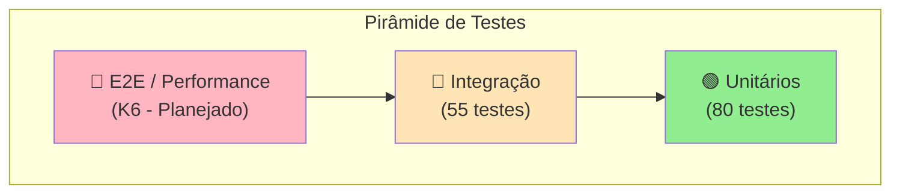
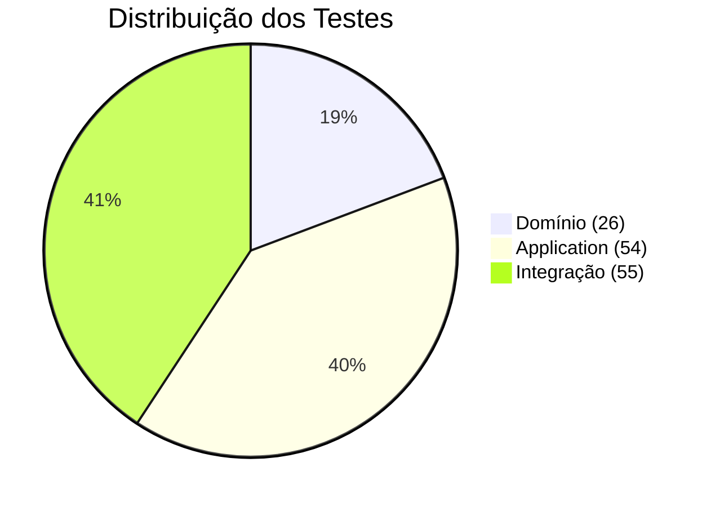

# 🧪 Estratégia de Testes

Este documento descreve a estratégia de testes adotada no projeto Cashflow, incluindo padrões, ferramentas e boas práticas.

## 🛠️ Stack de Testes

| Ferramenta | Propósito | Versão |
|------------|-----------|--------|
| **xUnit** | Framework de testes | 2.9.2 |
| **Shouldly** | Assertions fluentes | 4.3.0 |
| **Moq** | Mocking framework | 4.20.72 |
| **Testcontainers** | Containers para integração | 4.3.0 |
| **Coverlet** | Cobertura de código | 6.0.2 |

## 📐 Pirâmide de Testes



**Situação Atual:**
- ✅ **Testes Unitários**: 80 testes (Domínio + Application)
- ✅ **Testes de Integração**: 55 testes (Testcontainers)
- ⏳ **Testes de Performance**: Planejados com K6 (50 req/s)

## 📊 Resumo de Cobertura

| Projeto | Testes | Tipo |
|---------|--------|------|
| `Cashflow.Tests` | 26 | Unitário (Domínio) |
| `Cashflow.Application.Tests` | 54 | Unitário (Application) |
| `Cashflow.IntegrationTests` | 55 | Integração (API + DB) |
| **Total** | **135** | - |

### Por Camada



## 🎯 Padrão AAA (Arrange-Act-Assert)

Todos os testes seguem o padrão AAA:

```csharp
[Fact]
public void Deve_Criar_Lancamento_De_Credito_Com_Sucesso()
{
    // Arrange - Preparação
    var valor = 100.50m;
    var tipo = TipoLancamento.Credito;
    var data = new DateTime(2024, 1, 15);
    var descricao = "Venda de produto";

    // Act - Execução
    var lancamento = new Lancamento(valor, tipo, data, descricao);

    // Assert - Verificação
    lancamento.Id.ShouldNotBe(Guid.Empty);
    lancamento.Valor.ShouldBe(valor);
    lancamento.Tipo.ShouldBe(tipo);
}
```

## 📝 Convenção de Nomenclatura

### Padrão Adotado

```
Deve_[Comportamento]_Quando_[Cenário]
```

ou

```
[Método]_Deve_[Resultado]_[Condição]
```

### Exemplos

```csharp
// ✅ Bons nomes
Deve_Criar_Lancamento_De_Credito_Com_Sucesso()
Deve_Lancar_Excecao_Quando_Valor_For_Invalido()
ValorComSinal_Deve_Ser_Positivo_Para_Credito()
CriarAsync_DevePublicarEvento_QuandoSucesso()

// ❌ Nomes a evitar
TesteLancamento()
Test1()
LancamentoValido()
```

## 🧪 Tipos de Teste

### 1. Testes de Domínio (Cashflow.Tests)

Testam as regras de negócio no domínio:

```csharp
[Fact]
public void Deve_Criar_Lancamento_De_Credito_Com_Sucesso()
{
    var lancamento = new Lancamento(100m, TipoLancamento.Credito, DateTime.Today, "Venda");
    
    lancamento.ValorComSinal.ShouldBe(100m);
}

[Theory]
[InlineData(0)]
[InlineData(-1)]
public void Deve_Lancar_Excecao_Quando_Valor_For_Invalido(decimal valorInvalido)
{
    Should.Throw<ArgumentException>(() =>
        new Lancamento(valorInvalido, TipoLancamento.Credito, DateTime.Today, "Teste"));
}
```

### 2. Testes de Application (Cashflow.Application.Tests)

Testam os serviços da camada de aplicação com mocks:

```csharp
[Fact]
public async Task CriarAsync_DeveRetornarSucesso_QuandoDadosValidos()
{
    // Arrange
    var request = new CriarLancamentoRequest(100m, TipoLancamento.Credito, DateTime.Today, "Teste");
    _repositoryMock.Setup(r => r.AddAsync(It.IsAny<Lancamento>(), default))
        .Returns(Task.CompletedTask);
    _publisherMock.Setup(p => p.PublishAsync(It.IsAny<LancamentoCriadoEvent>(), default))
        .Returns(Task.CompletedTask);

    // Act
    var result = await _service.CriarAsync(request);

    // Assert
    result.IsSuccess.ShouldBeTrue();
    result.Value.ShouldNotBeNull();
}
```

### 3. Testes de Integração (Cashflow.IntegrationTests)

Testam a API completa com banco real via Testcontainers:

```csharp
[Fact]
public async Task CriarLancamento_DeveRetornarCreated_QuandoDadosValidos()
{
    // Arrange
    var request = new { Valor = 100m, Tipo = 0, Data = DateTime.Today, Descricao = "Teste" };

    // Act
    var response = await _client.PostAsJsonAsync("/api/lancamentos", request);

    // Assert
    response.StatusCode.ShouldBe(HttpStatusCode.Created);
}
```

## 🐳 Testcontainers

Os testes de integração usam Testcontainers para criar containers efêmeros:

```csharp
public class PostgreSqlContainerFixture : IAsyncLifetime
{
    private readonly PostgreSqlContainer _container = new PostgreSqlBuilder()
        .WithImage("postgres:16-alpine")
        .WithDatabase("cashflow_test")
        .Build();

    public async Task InitializeAsync() => await _container.StartAsync();
    public async Task DisposeAsync() => await _container.DisposeAsync();
}
```

### Containers Utilizados

| Container | Imagem | Propósito |
|-----------|--------|-----------|
| **PostgreSQL** | `postgres:16-alpine` | Banco de dados |
| **Redis** | `redis:7-alpine` | Cache |
| **RabbitMQ** | `rabbitmq:3-management-alpine` | Mensageria |

### Configuração para WSL

Para executar no Windows com WSL:

```properties
# ~/.testcontainers.properties
docker.host=tcp://localhost:2375
```

Ou via `test.runsettings`:

```xml
<RunSettings>
  <RunConfiguration>
    <EnvironmentVariables>
      <DOCKER_HOST>tcp://localhost:2375</DOCKER_HOST>
    </EnvironmentVariables>
  </RunConfiguration>
</RunSettings>
```

## 🏃 Executando os Testes

### Comandos

```bash
# Executar todos os testes
dotnet test

# Testes unitários apenas
dotnet test tests/Cashflow.Tests
dotnet test tests/Cashflow.Application.Tests

# Testes de integração (requer Docker)
dotnet test tests/Cashflow.IntegrationTests --settings tests/Cashflow.IntegrationTests/test.runsettings

# Com detalhes
dotnet test --verbosity detailed

# Com cobertura
dotnet test --collect:"XPlat Code Coverage"

# Filtrar por classe
dotnet test --filter "FullyQualifiedName~LancamentoTests"
```

### Resultado Esperado

```
Execução de Teste Bem-sucedida.
Total de testes: 135
     Aprovados: 130
     Ignorados: 5
```

## 📁 Estrutura de Testes

```
tests/
├── Cashflow.Tests/                      # Testes de Domínio
│   ├── LancamentoTests.cs               # Testes da entidade
│   ├── SaldoDiarioTests.cs              # Testes do Value Object
│   └── FluxoCaixaTests.cs               # Testes do agregado
│
├── Cashflow.Application.Tests/          # Testes de Application
│   ├── Services/
│   │   ├── LancamentoServiceTests.cs    # 19 testes
│   │   └── ConsolidadoServiceTests.cs   # 12 testes
│   └── Validators/
│       └── CriarLancamentoValidatorTests.cs  # 15 testes
│
└── Cashflow.IntegrationTests/           # Testes de Integração
    ├── Fixtures/                        # Configuração de containers
    │   ├── PostgreSqlContainerFixture.cs
    │   ├── RedisContainerFixture.cs
    │   ├── RabbitMqContainerFixture.cs
    │   └── WebApiFixture.cs
    ├── Endpoints/                       # Testes de endpoints
    │   ├── LancamentosEndpointsTests.cs
    │   ├── ConsolidadoEndpointsTests.cs
    │   └── HealthEndpointTests.cs
    ├── Repositories/                    # Testes de repositórios
    │   └── LancamentoRepositoryTests.cs
    └── Cache/                           # Testes de cache
        └── RedisCacheServiceTests.cs
```

## ✅ Cenários Cobertos

### Domínio (26 testes)

| Classe | Cenários |
|--------|----------|
| **Lancamento** | Criação, validação, ValorComSinal, EhDoDia |
| **SaldoDiario** | Cálculo, filtro por dia, edge cases |
| **FluxoCaixa** | Registrar, consolidar, relatório |

### Application (54 testes)

| Classe | Cenários |
|--------|----------|
| **LancamentoService** | CRUD, validação, publicação de eventos |
| **ConsolidadoService** | Cálculo, período, recálculo |
| **CriarLancamentoValidator** | Todas as regras de validação |

### Integração (55 testes)

| Área | Cenários |
|------|----------|
| **Endpoints** | Todos os endpoints da API |
| **Repositories** | CRUD com PostgreSQL real |
| **Cache** | Operações com Redis real |
| **Health** | Health checks funcionando |

## 🔮 Evolução Futura

### Testes de Performance (K6)

Planejados para validar os requisitos não-funcionais:

```javascript
// k6/load-test.js
import http from 'k6/http';
import { check } from 'k6';

export const options = {
    vus: 10,
    duration: '30s',
    thresholds: {
        http_req_duration: ['p(95)<100'],  // 95% < 100ms
        http_req_failed: ['rate<0.05'],    // < 5% falhas
    },
};

export default function () {
    const res = http.get('http://localhost:5000/api/consolidado/2024-01-15');
    check(res, {
        'status is 200': (r) => r.status === 200,
        'response time < 100ms': (r) => r.timings.duration < 100,
    });
}
```

**Metas:**
- 50 requisições/segundo no consolidado
- Tempo de resposta < 100ms (P95)
- Taxa de erro < 5%

## 📚 Referências

- [xUnit Documentation](https://xunit.net/docs/getting-started/netcore/cmdline)
- [Shouldly Documentation](https://docs.shouldly.org/)
- [Moq Documentation](https://github.com/moq/moq4)
- [Testcontainers .NET](https://testcontainers.com/guides/getting-started-with-testcontainers-for-dotnet/)
- [Unit Testing Best Practices](https://docs.microsoft.com/en-us/dotnet/core/testing/unit-testing-best-practices)
