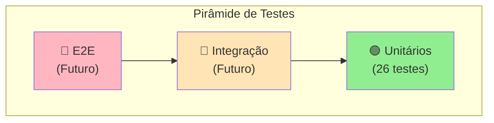
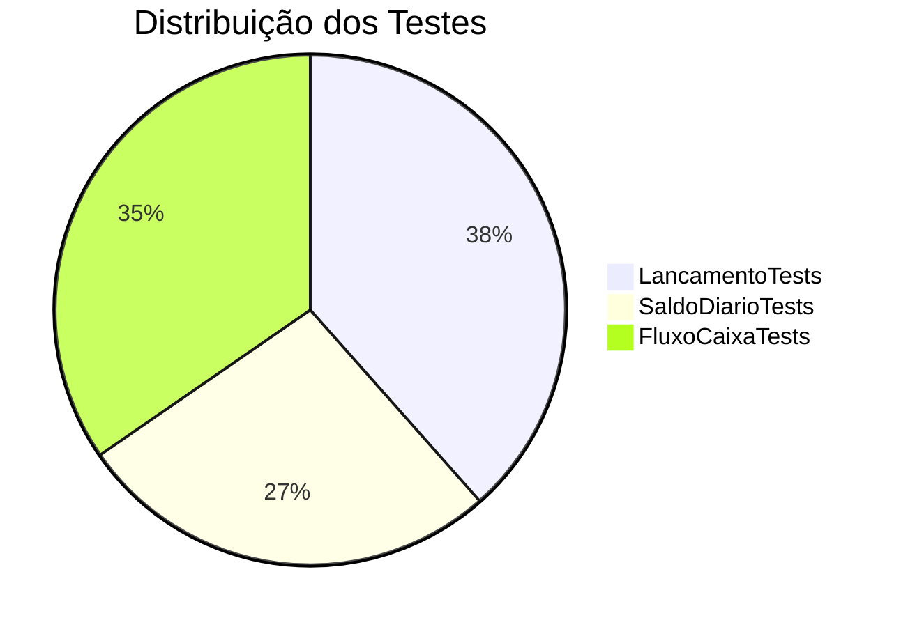
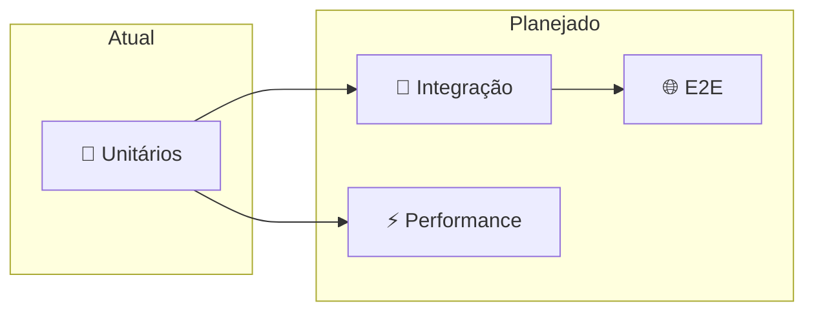

# 🧪 Estratégia de Testes

Este documento descreve a estratégia de testes adotada no projeto Cashflow, incluindo padrões, ferramentas e boas práticas.

## 🛠️ Stack de Testes

| Ferramenta | Propósito | Versão |
|------------|-----------|--------|
| **xUnit** | Framework de testes | 2.9.2 |
| **Shouldly** | Assertions fluentes | 4.3.0 |
| **Coverlet** | Cobertura de código | 6.0.2 |

## 📐 Pirâmide de Testes



**Situação Atual:**
- ✅ **Testes Unitários**: Implementados (26 testes)
- ⏳ **Testes de Integração**: Planejados para quando houver persistência
- ⏳ **Testes E2E**: Planejados para quando houver API

## 🎯 Padrão AAA (Arrange-Act-Assert)

Todos os testes seguem o padrão AAA:

```csharp
[Fact]
public void Deve_Criar_Lancamento_De_Credito_Com_Sucesso()
{
    // Arrange - Preparação
    var valor = 100.50m;
    var tipo = TipoLancamento.Credito;
    var data = new DateTime(2024, 1, 15);
    var descricao = "Venda de produto";

    // Act - Execução
    var lancamento = new Lancamento(valor, tipo, data, descricao);

    // Assert - Verificação
    lancamento.Id.ShouldNotBe(Guid.Empty);
    lancamento.Valor.ShouldBe(valor);
    lancamento.Tipo.ShouldBe(tipo);
}
```

## 📝 Convenção de Nomenclatura

### Padrão Adotado

```
Deve_[Comportamento]_Quando_[Cenário]
```

ou

```
[Método]_Deve_[Resultado]_[Condição]
```

### Exemplos

```csharp
// ✅ Bons nomes
Deve_Criar_Lancamento_De_Credito_Com_Sucesso()
Deve_Lancar_Excecao_Quando_Valor_For_Invalido()
ValorComSinal_Deve_Ser_Positivo_Para_Credito()
EhDoDia_Deve_Retornar_True_Para_Mesmo_Dia()

// ❌ Nomes a evitar
TesteLancamento()
Test1()
LancamentoValido()
```

## 🔍 Por que Shouldly?

### Comparação de Sintaxe

```csharp
// ❌ Assert tradicional (xUnit)
Assert.Equal(100m, lancamento.Valor);
Assert.NotEqual(Guid.Empty, lancamento.Id);
Assert.True(lancamento.EhDoDia(hoje));

// ✅ Shouldly (mais legível)
lancamento.Valor.ShouldBe(100m);
lancamento.Id.ShouldNotBe(Guid.Empty);
lancamento.EhDoDia(hoje).ShouldBeTrue();
```

### Mensagens de Erro

```csharp
// Shouldly gera mensagens mais claras:
// "lancamento.Valor should be 100m but was 50m"
```

## 📊 Cobertura de Testes

### Por Classe



### Cenários Cobertos

#### Lancamento (10 testes)

| Cenário | Tipo |
|---------|------|
| Criação de crédito válido | Happy Path |
| Criação de débito válido | Happy Path |
| ValorComSinal positivo para crédito | Comportamento |
| ValorComSinal negativo para débito | Comportamento |
| Validação de valor zero | Edge Case |
| Validação de valor negativo | Edge Case |
| Validação de descrição vazia | Edge Case |
| Validação de descrição nula | Edge Case |
| EhDoDia para mesmo dia | Comportamento |
| EhDoDia para dia diferente | Comportamento |

#### SaldoDiario (7 testes)

| Cenário | Tipo |
|---------|------|
| Cálculo correto de saldo | Happy Path |
| Ignora lançamentos de outros dias | Filtro |
| Saldo zero sem lançamentos | Edge Case |
| Saldo negativo (débitos > créditos) | Edge Case |
| Factory method Vazio() | Criação |
| Exceção para null | Validação |

#### FluxoCaixa (9 testes)

| Cenário | Tipo |
|---------|------|
| Registrar crédito | Happy Path |
| Registrar débito | Happy Path |
| Saldo diário consolidado | Happy Path |
| Saldo acumulado | Cálculo |
| Relatório consolidado | Happy Path |
| Dias sem lançamentos no relatório | Edge Case |
| Validação de período inválido | Edge Case |
| Lançamentos do dia | Filtro |

## 🧪 Tipos de Teste Utilizados

### Fact (Teste Simples)

```csharp
[Fact]
public void Deve_Criar_Lancamento_De_Credito_Com_Sucesso()
{
    // Teste único, sem parâmetros
}
```

### Theory (Teste Parametrizado)

```csharp
[Theory]
[InlineData(0)]
[InlineData(-1)]
[InlineData(-100)]
public void Deve_Lancar_Excecao_Quando_Valor_For_Invalido(decimal valorInvalido)
{
    // Mesmo teste executado com diferentes valores
    Should.Throw<ArgumentException>(() =>
        new Lancamento(valorInvalido, TipoLancamento.Credito, DateTime.Today, "Teste"));
}
```

## 🏃 Executando os Testes

### Comandos

```bash
# Executar todos os testes
dotnet test

# Com detalhes
dotnet test --verbosity detailed

# Com cobertura
dotnet test --collect:"XPlat Code Coverage"

# Filtrar por classe
dotnet test --filter "FullyQualifiedName~LancamentoTests"

# Filtrar por nome
dotnet test --filter "DisplayName~Credito"
```

### Resultado Esperado

```
Execução de Teste Bem-sucedida.
Total de testes: 26
     Aprovados: 26
```

## 📁 Estrutura de Testes

```
tests/
└── Cashflow.Tests/
    ├── Cashflow.Tests.csproj
    ├── LancamentoTests.cs      # Testes da entidade Lancamento
    ├── SaldoDiarioTests.cs     # Testes do Value Object SaldoDiario
    └── FluxoCaixaTests.cs      # Testes do agregado FluxoCaixa
```

### Convenção de Arquivo

```
[NomeDaClasse]Tests.cs
```

## ✅ Boas Práticas Adotadas

### 1. Um Assert Lógico por Teste

```csharp
// ✅ Múltiplos asserts relacionados (mesmo conceito)
lancamento.Id.ShouldNotBe(Guid.Empty);
lancamento.Valor.ShouldBe(valor);
lancamento.Tipo.ShouldBe(tipo);

// ❌ Evitar testar coisas não relacionadas
lancamento.Valor.ShouldBe(valor);
outroLancamento.Valor.ShouldBe(outroValor); // Deveria ser outro teste
```

### 2. Testes Independentes

Cada teste é independente e não depende de ordem de execução ou estado compartilhado.

### 3. Nomes Descritivos

O nome do teste descreve exatamente o que está sendo testado.

### 4. Teste de Exceções

```csharp
Should.Throw<ArgumentException>(() =>
    new Lancamento(0, TipoLancamento.Credito, DateTime.Today, "Teste"))
    .Message.ShouldContain("maior que zero");
```

### 5. Dados de Teste Explícitos

```csharp
// ✅ Valores explícitos e significativos
var valor = 100.50m;
var data = new DateTime(2024, 1, 15);

// ❌ Evitar valores mágicos
var lancamento = new Lancamento(100, tipo, DateTime.Now, "x");
```

## 🔮 Evolução Futura



| Tipo | Quando Implementar | Ferramentas Sugeridas |
|------|-------------------|----------------------|
| Integração | Ao adicionar banco de dados | Testcontainers, SQLite in-memory |
| E2E | Ao adicionar API | WebApplicationFactory, Playwright |
| Performance | Ao escalar | BenchmarkDotNet |

## 📚 Referências

- [xUnit Documentation](https://xunit.net/docs/getting-started/netcore/cmdline)
- [Shouldly Documentation](https://docs.shouldly.org/)
- [Unit Testing Best Practices](https://docs.microsoft.com/en-us/dotnet/core/testing/unit-testing-best-practices)

